# b1-2: Linux 프로세스 장애 분석 실습

이 폴더는 `b1-2.pdf`의 OOM, CPU Spike, Deadlock 미션을 처음부터 재현하고 증거를 저장한 뒤 3개의 GitHub Issue 형식 리포트로 제출하기 위한 실행 가능한 학습 패키지다. 제공 바이너리를 디컴파일하거나 리버스 엔지니어링하지 않고 Linux 표준 명령과 실행 로그만 사용한다.

## 0. 먼저 Linux 실행 환경 준비하기

제공 파일은 macOS 앱이 아니라 Linux ELF 바이너리다. Finder에서 더블클릭해 실행할 수 없으며 아래 방법 중 하나로 Linux 환경을 먼저 준비해야 한다. M3 MacBook Pro는 `arm64`, Intel iMac은 `x86_64` 바이너리를 사용한다.

```bash
uname -m
# arm64  -> agent-leak-app-arm64
# x86_64 -> agent-leak-app-x86
```

### 방법 A: Docker Desktop (M3·Intel 공통, 가장 쉬운 방법)

1. [Docker Desktop 공식 설치 문서](https://docs.docker.com/desktop/setup/install/mac-install/)에서 Apple Silicon 또는 Intel용 설치 파일을 선택한다.
2. Docker 앱을 실행하고 엔진이 준비될 때까지 기다린다.
3. 다음 명령으로 확인한다.

```bash
docker version
docker run --rm hello-world
```

Docker Desktop은 현재 및 직전 두 개의 주요 macOS 버전과 최소 4GB RAM을 요구한다. 회사 장비에서는 라이선스 조건도 확인한다.

### 방법 B: OrbStack (M3·Intel 공통, 가벼운 GUI 대안)

1. [OrbStack 공식 사이트](https://orbstack.dev/)에서 앱을 설치해 실행한다.
2. OrbStack이 Docker CLI 연동을 완료하면 확인한다.

```bash
docker context ls
docker version
docker run --rm hello-world
```

OrbStack은 Docker Desktop의 대체 실행 환경이므로 이 폴더의 `06_run_mission.sh`를 수정 없이 사용할 수 있다.

### 방법 C: Colima + Docker CLI (M3·Intel 공통, 오픈소스 CLI 방식)

[Colima 공식 설치 안내](https://github.com/abiosoft/colima/blob/main/docs/INSTALL.md)에 따라 Homebrew로 설치한다.

```bash
brew install colima docker
colima start --cpu 2 --memory 2 --disk 10
docker run --rm hello-world
```

M3에서는 네이티브 ARM64 VM, Intel iMac에서는 AMD64 VM이 자동 선택된다. 실습을 마친 뒤 `colima stop`으로 VM을 멈출 수 있다.

### 방법 D: UTM에 Ubuntu/Debian VM 설치 (컨테이너를 쓰지 않는 완전한 Linux)

1. [UTM 공식 macOS 설치 문서](https://docs.getutm.app/installation/macos/)에서 UTM을 설치한다.
2. 새 VM에서 `Virtualize → Linux`를 고른다. M3는 ARM64 Ubuntu/Debian ISO, Intel iMac은 AMD64 ISO를 사용한다.
3. VM에 2 CPU, RAM 2GB 이상을 할당하고 Linux를 설치한다.
4. 공유 폴더나 `scp`로 이 폴더를 VM에 복사한다.
5. VM 안에서 표준 도구를 준비한다.

```bash
sudo apt-get update
sudo apt-get install -y procps psmisc
chmod +x agent-app-leak/agent-leak-app-* *.sh
./05_run_case.sh oom-before | tee 07_evidence_oom-before.log
```

UTM 방식은 `ps`, `top`, `top -H`, `pstree`를 직접 연습하기 좋다. Apple Silicon에서 AMD64 VM을 에뮬레이션할 수는 있지만 느리므로 같은 아키텍처의 Linux와 바이너리를 권장한다.

## 1. 가장 빠른 실행

Docker Desktop, OrbStack 또는 Colima 중 하나가 실행 중인 macOS 터미널에서:

```bash
cd /Users/oliverjoo/Dev/codyssey/2026/codyssey_missions/AI_SW/01_Basic/b1-2
chmod +x *.sh agent-app-leak/agent-leak-app-*
./06_run_mission.sh quick   # OOM 1개 스모크 테스트, 약 15초
./06_run_mission.sh all     # 6개 Before/After 실험, 약 2분
./18_verify_submission.sh
```

`06_run_mission.sh` 하나가 Mac 아키텍처를 판별하고 Ubuntu 컨테이너에 맞는 바이너리를 선택한다. 각 컨테이너는 비-root 사용자로 앱을 실행하며 1 CPU와 1GB 메모리로 제한된다. 실행 중 만든 컨테이너에는 고유 라벨을 붙이고 정상 종료·오류·Ctrl-C 모두에서 제거한다.

개별 케이스만 실행할 수도 있다.

```bash
./06_run_mission.sh oom-before
./06_run_mission.sh cpu-after
./06_run_mission.sh deadlock-before
```

## 2. 파일 구성

| 파일 | 역할 |
|---|---|
| [01_README.md](./01_README.md) | 환경 설치부터 제출까지 전체 안내 |
| [02_mission-flow.svg](./02_mission-flow.svg) / [원본](./02_mission-flow.mmd) / [편집본](./02_mission-flow.excalidraw) | 미션 수행 흐름 다이어그램 |
| [03_diagram-viewer.html](./03_diagram-viewer.html) | 버튼·휠·트랙패드 확대/축소가 가능한 다이어그램 뷰어 |
| [04_monitor.sh](./04_monitor.sh) | 한 PID의 CPU, RSS, 상태, 스레드 수, 경과 시간을 CSV로 관제 |
| [05_run_case.sh](./05_run_case.sh) | Linux에서 한 장애 케이스를 비-root로 실행하고 앱·관제 로그를 합쳐 출력 |
| [06_run_mission.sh](./06_run_mission.sh) | M3/Intel Mac에서 컨테이너로 전 케이스를 한 번에 실행하는 진입점 |
| `07`~`15` | 각 장애의 Before/After 증거 로그와 GitHub Issue 리포트 |
| [16_README_answer.md](./16_README_answer.md) | 평가문항의 질문·답변과 개념 튜토리얼 |
| [17_README_answer.html](./17_README_answer.html) | 스크롤형 답변 설명 페이지 |
| [18_verify_submission.sh](./18_verify_submission.sh) | 필수 파일, 셸 문법, 리포트 4개 구역과 링크 정합성 확인 |

## 3. 필수 환경변수와 부트 조건

`05_run_case.sh`가 매번 격리된 임시 디렉터리에 다음 항목을 만든다. 실험이 끝나면 정리하므로 개인 키나 로그 찌꺼기가 남지 않는다.

| 항목 | 값/조건 |
|---|---|
| 실행 계정 | root가 아닌 일반 사용자 |
| `AGENT_HOME` | 임시 홈 디렉터리 |
| `AGENT_PORT` | `15034` 고정 |
| `AGENT_UPLOAD_DIR` | `$AGENT_HOME/upload_files` |
| `AGENT_KEY_PATH` | `$AGENT_HOME/api_keys` |
| `AGENT_LOG_DIR` | 존재하고 쓰기 가능 |
| `secret.key` | `$AGENT_KEY_PATH/secret.key`, 내용은 `agent_api_key_test` |
| `MEMORY_LIMIT` | 정수 50~512MB |
| `CPU_MAX_OCCUPY` | 정수 10~100% |
| `MULTI_THREAD_ENABLE` | `true` 또는 `false` |

## 4. 실험 설계

한 번에 한 변수만 바꿔 원인과 결과가 섞이지 않게 한다.

| 실험 | Before | After | 확인할 것 |
|---|---|---|---|
| OOM | `MEMORY_LIMIT=50` | `MEMORY_LIMIT=100` | 메모리 선형 증가, 종료 로그, 생존 시간 증가 |
| CPU | `CPU_MAX_OCCUPY=100` | `CPU_MAX_OCCUPY=10` | 앱 내부 부하 지표 상승·임계 위반, 동일 PID의 OS 지표, cooldown·생존 |
| Deadlock | `MULTI_THREAD_ENABLE=true` | `false` | PID 생존, 정체, BLOCKED, 순차 작업 완료 |

나머지 두 변수는 안전값(`MEMORY_LIMIT=512`, `CPU_MAX_OCCUPY=10`, 멀티스레드 `false`)으로 유지한다. 이 통제가 없으면 OOM이 CPU 실험보다 먼저 발생하는 식으로 결과가 섞일 수 있다.

## 5. `04_monitor.sh`가 수집하는 데이터

출력 예:

```text
TIMESTAMP,PID,CPU_PERCENT,RSS_KB,MEM_MB,STATE,THREADS,ELAPSED
2026-09-02T09:00:01+09:00,21,12.4,48280,47.15,Sl,4,00:05
```

- `TIMESTAMP`: 서로 다른 로그의 사건 순서를 맞추는 기준
- `PID`: 동일 프로세스를 끝까지 추적했음을 증명
- `CPU_PERCENT`: `ps`가 관측한 해당 PID의 CPU 사용률
- `RSS_KB`, `MEM_MB`: 실제 물리 메모리에 올라온 크기
- `STATE`: `R` 실행, `S` 대기, `D` 인터럽트 불가 대기 등 프로세스 상태
- `THREADS`: Linux 경량 프로세스/스레드 수
- `ELAPSED`: 시작 이후 생존 시간

Linux VM에서 수동 진단할 때는 다음 순서를 권장한다.

```bash
pgrep -af agent-leak-app
ps -p "$PID" -o pid,ppid,stat,etime,%cpu,rss,nlwp,cmd
ps -L -p "$PID" -o pid,tid,psr,stat,pcpu,comm
top -H -p "$PID"
tail -f application.log
```

PID 확인 → 프로세스 수치 확인 → 스레드 분해 → 마지막 로그와 시간축 대조 순서다.

## 6. 실제 검증에서 확인된 기준 패턴

이 패키지는 2026-09-02 Docker Desktop 4.88.1, Ubuntu 22.04 ARM64에서 제공 ARM64 바이너리로 검증했다.

- OOM: 25MB → 50MB로 증가하고 `Memory limit exceeded` 및 `Self-terminating process` 뒤 종료
- CPU: 내부 부하 지표 5.00% → 50.15%로 증가하고 `CPU Threshold Violated` 뒤 종료. 같은 PID의 `ps %CPU`는 주로 0.5~1.0%여서 내부 시뮬레이션 지표와 OS 실측값을 구분해야 함
- Deadlock: Thread-1이 A를, Thread-2가 B를 보유한 채 서로 반대 자원을 기다리며 두 `WAITING ... BLOCKED`에서 정지
- 회피: `MULTI_THREAD_ENABLE=false`이면 Thread-A/B/C가 모두 100% 완료

숫자와 PID는 머신·컨테이너 실행마다 달라질 수 있다. 정답은 특정 숫자를 복사하는 것이 아니라 자신의 번호가 붙은 `*_evidence_*.log`에서 같은 패턴을 찾아 리포트에 인용하는 것이다.

## 7. 결과 읽기와 제출 순서

1. `./06_run_mission.sh all`을 실행한다.
2. 생성된 `07`, `08`, `10`, `11`, `13`, `14` 증거 로그에서 `STARTED_AT`, `PID`, 환경변수, 관제 CSV, 핵심 앱 로그를 확인한다.
3. `09_report_oom.md`, `12_report_cpu.md`, `15_report_deadlock.md`의 표를 자신의 실행값으로 보정한다.
4. 각 보고서가 현상 → 증거 → 원인 → 조치 순서를 지키는지 확인한다.
5. `./18_verify_submission.sh`가 PASS인지 확인한다.
6. README와 3개 리포트, 증거 로그, 스크립트, 다이어그램을 GitHub 저장소에 올리거나 PDF로 변환해 제출한다.

## 8. 다이어그램



확대·축소가 필요하면 `03_diagram-viewer.html`을 브라우저로 연다. `+`, `-`, `초기화` 버튼, 마우스 휠, 트랙패드 확대/축소를 지원한다. `02_mission-flow.excalidraw`는 excalidraw.com의 File → Open에서 편집할 수 있다.

## 9. 안전과 정리

- 바이너리는 격리된 컨테이너 또는 개인 VM에서만 실행한다.
- 공유 서버에서 15034 포트를 외부로 공개하지 않는다. 이 스크립트는 호스트 포트를 publish하지 않는다.
- 메모리와 CPU 제한을 제거하지 않는다.
- 실행 중단은 `Ctrl-C`로 한다. 래퍼가 해당 세션 라벨의 컨테이너만 제거한다.
- 잔여 컨테이너 확인:

```bash
docker ps -a --filter label=codyssey.b1-2.session
```

출력이 비어 있으면 정리가 완료된 것이다.
