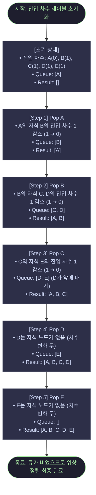
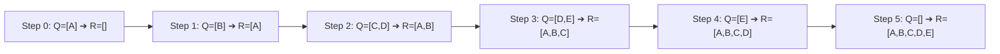

# BFS 기반 위상 정렬 및 탐색 알고리즘 분석 (Kahn's Algorithm & BFS)

이 문서는 `main.py` 파일 내에 구현된 그래프 탐색 및 위상 정렬 알고리즘의 동작 방식을 분석합니다.

현재 [main.py](file:///Users/oliverjoo/Dev/codyssey/2026/codyssey_missions/AI_SW/01_Basic/b3-2/mini-git/main.py) 저장소 시스템에는 **BFS(너비 우선 탐색) 및 대기 큐(Queue) 기반 알고리즘**이 구현되어 있습니다.

---

## 1. BFS 기반 위상 정렬: 칸(Kahn) 알고리즘

위상 정렬(Topological Sort)은 방향성이 있고 사이클이 없는 그래프(DAG)에서 모든 노드를 인과적 순서에 맞춰 나열하는 알고리즘입니다. [cmd_log](file:///Users/oliverjoo/Dev/codyssey/2026/codyssey_missions/AI_SW/01_Basic/b3-2/mini-git/main.py#L139-L186) 함수에서는 큐를 사용하는 **Kahn 알고리즘**을 채택하여 구현했습니다.

### A. Kahn 알고리즘의 3대 핵심 개념

1. **진입 차수(In-degree)**
   * 어떤 노드로 들어오는 간선(화살표)의 개수입니다. Git 커밋 그래프에서는 **"자식 노드가 가진 부모 커밋의 수"**를 의미합니다.
   * 진입 차수가 `0`이라는 것은 선행되어야 하는 부모 커밋이 없음을 의미하므로, 탐색의 시작점이 될 수 있습니다.
2. **간선(Edge) 제거와 차수 갱신**
   * 선행 작업이 끝난 노드를 정렬 완료 리스트에 담은 뒤, 해당 노드에서 뻗어나가는 모든 간선을 그래프에서 제거합니다.
   * 간선이 제거됨에 따라 자식 노드들의 진입 차수가 감소하게 되며, 진입 차수가 `0`으로 떨어진 자식 노드는 새로운 탐색 후보가 되어 큐에 적재됩니다.
3. **사이클(Cycle) 감지**
   * 그래프에 서로 물고 물리는 순환 구조(Cycle)가 있다면, 사이클에 포함된 노드들은 진입 차수가 결코 `0`이 되지 못해 큐에 들어가지 못합니다.
   * 루프가 끝난 후 정렬된 결과 리스트의 크기가 전체 노드 수보다 작다면 **그래프에 사이클이 존재함**을 $O(1)$ 시간 내에 정확히 판별할 수 있습니다.

---

### B. 핵심 코드 구현 상세 주석

```python
# 1. 모든 노드의 진입 차수(in-degree)와 자식 목록(adjacency list)을 0과 빈 리스트로 초기화합니다.
in_degree = {h: 0 for h in self.commits}
children  = {h: [] for h in self.commits}

# 2. 커밋 저장소 정보를 돌며 그래프를 구축합니다.
# parents 포인터(자식 -> 부모)를 뒤집어서 부모 -> 자식 방향의 단방향 간선으로 변환합니다.
for h, c in self.commits.items():
    for p in c.parents:
        if p in self.commits:
            in_degree[h] += 1       # 자식 커밋 h의 진입 차수(필수 선행 부모 수)를 1 증가시킵니다.
            children[p].append(h)   # 부모 커밋 p의 자식 인접 리스트에 h를 등록합니다.
          
# 3. 진입 차수가 0인(더 이상 올라갈 부모가 없는 루트 커밋) 노드를 찾아 BFS용 큐에 넣습니다.
queue  = deque([h for h, d in in_degree.items() if d == 0])
result = []

# 4. 큐가 빌 때까지 FIFO 방식으로 노드를 꺼내며 BFS 탐색을 진행합니다.
while queue:
    node = queue.popleft()            # 가장 먼저 진입 차수가 0이 된 노드를 꺼냅니다 (너비 우선).
    result.append(self.commits[node]) # 정렬 결과에 해당 커밋을 등록합니다.
  
    # 꺼낸 노드의 자식들을 탐색하며 간선을 끊어줍니다.
    for ch in children[node]:
        in_degree[ch] -= 1            # 부모(node)가 처리되었으므로 자식(ch)의 진입 차수를 1 감소시킵니다.
        if in_degree[ch] == 0:        # 모든 선행 조건이 해결되어 진입 차수가 0이 되었다면
            queue.append(ch)          # 새로운 탐색 대상으로 대기 큐에 삽입합니다.
```

---

### C. 데이터 흐름 및 상태 변화 도식화

아래 다이어그램은 특정 브랜치 분기가 존재하는 그래프에 대해 Kahn 알고리즘이 매 루프마다 **진입 차수(In-degree)를 깎고, 큐(Queue)에 데이터를 추가하고, 최종 결과(Result)를 누적하는 데이터의 동적 흐름**을 명확히 추적한 결과입니다.

**대상 그래프 구조:**

```text
     A (최초 커밋) - In-degree: 0
     │
     B (두 번째 커밋) - In-degree: 1 (from A)
    ╱ ╲
   C   D (B에서 분기된 브랜치) - C: 1 (from B), D: 1 (from B)
   │
   E (C의 후속 커밋) - In-degree: 1 (from C)
```



* **수평적 데이터 흐름 요약:**



* **Kahn 알고리즘의 BFS적 성격 관찰**: `Step 3` 단계에서 `C`가 처리될 때 그 자식인 `E`가 큐에 새로 추가되지만, 이미 큐의 앞에 대기하고 있던 형제 브랜치의 노드 `D`가 `E`보다 한 단계 먼저 꺼내져 처리(`Step 4`)되는 것을 확인할 수 있습니다.

---

## 2. main.py 내의 다른 BFS 기능들

위상 정렬뿐만 아니라 `main.py`에 포함된 모든 탐색 명령어 또한 `deque`를 활용한 BFS 기반으로 설계되었습니다.

### A. 조상 탐색 (`cmd_ancestors`)

* **역할**: 지정된 커밋의 모든 조상 커밋들을 역추적하여 출력합니다.
* **원리**: 부모 커밋 목록(`parents`)을 BFS 큐에 순차적으로 넣고 `popleft()`로 꺼내가며 탐색하여, 조상 트리를 넓게 펼쳐가며 추적합니다.

### B. 최단 경로 탐색 (`cmd_path`)

* **역할**: 두 커밋 간의 무방향 최단 경로를 찾습니다.
* **원리**: 가중치가 없는 그래프에서 **최단 경로(최소 간선 수)를 보장하는 가장 대표적인 방법이 BFS**입니다. 시작점부터 모든 경로를 너비 우선으로 탐색하며 목적지에 가장 먼저 도달하는 경로를 확정합니다.

---

## 3. 이 프로젝트에서 DFS 대신 BFS를 전면 채택한 이유 (설계적 관점)

1. **최단 경로의 보장 (`PATH` 기능)**
   * 가중치가 1로 일정한 그래프에서 최단 경로를 찾을 때, DFS는 경로의 최소 길이를 보장하지 못해 모든 경로를 다 탐색하고 비교해야 하는 비효율이 발생합니다. 반면 **BFS는 목적지에 도달하는 순간이 무조건 최단 경로**이므로 매우 효율적입니다.
2. **시스템 안정성 (스택 오버플로우 방지)**
   * Git 저장소의 커밋 로그는 한 방향으로 길게 쭉 이어지는 **선형 구조(Linear History)**가 일반적입니다.
   * 이러한 극단적인 선형 구조에서 DFS(재귀 호출)를 사용하면 재귀 깊이가 커밋 수 $N$만큼 증가하여 파이썬 기본 재귀 제한을 넘는 **`RecursionError`**를 일으키기 쉽습니다. 반면 BFS는 루프 기반의 큐를 사용하므로 호출 스택 오버플로우 리스크가 원천 차단됩니다.
