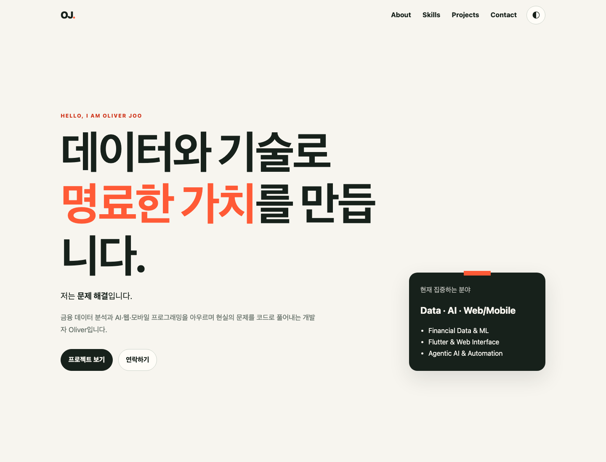
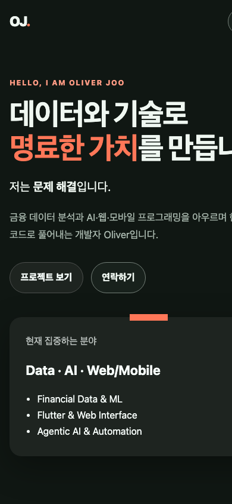

# b4-1: 순수 HTML/CSS/JavaScript 포트폴리오

`b4-1.pdf`의 요구사항을 따라 외부 프레임워크 없이 만든 반응형 포트폴리오다. 화면을 꾸미는 것보다 **사용자 이벤트 → 상태 변경 → DOM 업데이트** 흐름을 이해하고 설명하는 데 초점을 둔다.

## 1. 먼저 실행하기

### 방법 A: VS Code + Live Server

1. VS Code에서 이 폴더를 연다.
2. Extensions에서 `Live Server`를 설치한다.
3. `index.html`을 열고 우측 아래 `Go Live`를 누른다.

### 방법 B: 설치 없는 Python 서버

macOS와 일반적인 Linux에는 Python 3가 설치되어 있다.

```bash
chmod +x 01_run_local.sh 04_verify_submission.sh
./01_run_local.sh
```

브라우저에서 <http://127.0.0.1:8000>을 연다. 다른 포트를 쓰려면 `./01_run_local.sh 8080`처럼 실행한다. `file://`로 직접 열 수도 있지만, 실제 배포와 비슷한 HTTP 환경에서 확인하는 편이 좋다.

## 2. 파일 구성

```text
b4-1/
├── index.html                 # 시맨틱 문서 구조
├── css/style.css              # 반응형·테마·애니메이션
├── js/app.js                  # 이벤트·상태·API·렌더링
├── images/profile.svg         # 의미 있는 alt가 연결된 프로필 그림
├── screenshots/              # 검증한 데스크톱·모바일 화면
├── 01_run_local.sh            # 로컬 실행 진입점
├── 02_portfolio-flow.*        # Mermaid/Excalidraw/SVG/PNG 다이어그램
├── 03_diagram-viewer.html     # 확대·축소 다이어그램 뷰어
├── 04_verify_submission.sh    # 제출 정합성 검사
├── README.md                  # 실행·구조·배포 안내
├── README_answer.md           # 15개 평가 질문 답변과 튜토리얼
└── README_answer.html         # 스크롤형 답변 설명 페이지
```

PDF가 `css/`, `js/`, `images/` 역할 분리를 요구하므로 모든 산출물은 `b4-1` 안에 두되 코드 자산은 하위 폴더로 분리했다.

## 3. 구현 기능

| 요구사항 | 구현 위치 | 확인 방법 |
|---|---|---|
| Hero, About, Skills, Projects, Contact, Footer | `index.html` | 메뉴와 스크롤로 여섯 영역 확인 |
| 모바일 메뉴 | `js/app.js`의 `setMenuOpen`, `renderMenu` | 768px 미만에서 햄버거 클릭 |
| 다크 모드 유지 | `setTheme`, `localStorage` | 전환 후 새로고침 |
| 부드러운 스크롤 | 앵커 `click` 이벤트 | 메뉴 링크 클릭 |
| 헤더 변경 | `scroll` 이벤트 | 60px 이상 스크롤 |
| 맨 위로 버튼 | `scroll` 이벤트 | 300px 이상 스크롤 후 `↑` 클릭 |
| 등장 애니메이션 | `IntersectionObserver` | 임계값 0.2에서 섹션 노출 |
| GitHub API | `loadProjects` | 사용자 이름을 입력해 저장소 호출 |
| API 4상태 | `renderProjects` | loading/success/error/empty UI |
| 언어 필터 | `renderProjectFilters` | 프로젝트 언어 버튼 클릭 |
| 폼 검증 & 전송 | `validateField`, Formspree | 빈 값·이메일 검증 및 Formspree 비동기 이메일 전송 |
| 타이핑 효과 | `initializeTypingEffect` | Hero 역할 문구 확인 |
| 시스템 테마 감지 | `getInitialTheme` | 저장값이 없을 때 OS 테마 반영 |

스크롤 기준은 헤더 `60px`, 맨 위로 버튼 `300px`, Intersection Observer `threshold: 0.2`다.

## 4. GitHub 사용자 이름 바꾸기

첫 화면은 기본적으로 `OliverJoo` 계정의 공개 저장소를 불러온다. Projects 영역 입력창에 다른 사용자 아이디를 입력하면 즉시 바꿀 수 있다. 기본값 자체를 바꾸려면 `index.html`의 다음 속성을 수정한다.

```html
<body data-github-username="OliverJoo">
```

API 주소는 다음과 같다.

```text
https://api.github.com/users/{username}/repos?sort=updated&per_page=12
```

인증 없는 GitHub API는 호출 제한(시간당 60회)이 있으므로 짧은 시간에 반복 새로고침하지 않는다. 403 응답이나 네트워크 에러 발생 시 화면에 오류 메시지와 함께 `다시 시도` 버튼 및 내장된 `샘플 데이터 보기` 버튼이 표시되어 중단 없는 열람을 지원한다.

## 5. 이벤트 → 상태 → 렌더링 구조

### 다크 모드

```text
테마 버튼 click
→ state.theme 변경
→ localStorage 저장
→ documentElement의 data-theme 변경
→ CSS 변수 전체 교체
```

### GitHub 프로젝트

```text
폼 submit 또는 최초 로드
→ state.projects.status = loading
→ API 성공: items 저장 / 실패: error 저장
→ renderProjects()
→ 로딩·성공·에러·빈 화면 중 하나 표시
```

### 문의 폼 (Formspree 이메일 전송)

```text
input 또는 submit
→ state.form.errors 변경 및 실시간 피드백
→ 전체 필드 유효성 통과 시 Formspree 비동기 POST
→ 전송 중 버튼 비활성화 및 로딩 피드백
→ 성공 시 완료 안내 표시 및 폼 초기화
```

구조 다이어그램은 [02_portfolio-flow.svg](./02_portfolio-flow.svg)에서 볼 수 있고, 확대가 필요하면 [03_diagram-viewer.html](./03_diagram-viewer.html)을 연다.

## 6. HTML 설계 기준

- `<header>`: 고정 헤더와 전체 탐색 영역
- `<nav>`: 페이지 내부 이동 링크
- `<main>`: 페이지의 고유한 핵심 콘텐츠
- `<section>`: 주제가 다른 Hero/About/Skills/Projects/Contact 영역
- `<article>`: 독립적으로 읽을 수 있는 자기소개·기술·프로젝트 카드
- `<footer>`: 저작권과 외부 링크
- `<label for>`와 입력 요소 `id`: 이름·이메일·메시지 연결
- 의미가 있는 프로필 이미지: 구체적인 `alt` 제공

`div`는 의미가 없는 레이아웃 묶음에만 사용했다.

## 7. CSS 설계 기준

- `:root`: 배경, 글자, 강조색, 간격, 그림자 등 디자인 토큰 정의
- `[data-theme="dark"]`: 같은 변수 이름의 값만 교체해 전체 테마 변경
- Flexbox: 한 방향으로 정렬하는 내비게이션·버튼·메타 정보
- Grid: 행과 열을 함께 다루는 Skills·Projects 카드와 큰 화면 분할
- 모바일 퍼스트: 기본 스타일은 작은 화면, `768px`, `1024px`에서 확장
- `prefers-reduced-motion`: 움직임에 민감한 사용자는 애니메이션 최소화

## 8. JavaScript 설계 기준

- `const`, `let`만 사용하고 HTML 인라인 이벤트를 사용하지 않는다.
- `querySelector`/`querySelectorAll`로 DOM을 선택한다.
- `addEventListener`로 `click`, `submit`, `scroll`, `input`을 연결한다.
- `map`으로 저장소 배열을 카드 HTML로 변환한다.
- `filter`로 선택한 언어의 저장소만 남긴다.
- `forEach`로 링크·입력·관찰 대상을 순회한다.
- 구조분해 할당과 템플릿 리터럴로 데이터 사용 위치를 명확히 한다.
- API 문자열은 `escapeHtml`을 거쳐 동적 HTML에 넣는다.

## 9. 제출 전 검사

```bash
./04_verify_submission.sh
```

검사 항목:

- 필수 파일 존재와 Bash/JavaScript 문법
- 인라인 `onclick`, `style`, JavaScript `var` 미사용
- 시맨틱 태그 존재
- HTML의 로컬 링크와 앵커 대상
- `README_answer.md` 15개 질문과 관련 파일 링크
- `README_answer.html` 15개 답변 카드와 관련 링크

수동 검사도 함께 진행한다.

1. Chrome DevTools에서 390px, 768px, 1440px 폭을 확인한다.
2. 다크 모드 전환 후 새로고침한다.
3. 정상 GitHub 아이디, 존재하지 않는 아이디, 언어 필터를 시험한다.
4. 문의 폼을 빈 값, 잘못된 이메일, 정상 값으로 제출한다.
5. 키보드 `Tab`만으로 메뉴·버튼·폼을 이동한다.

## 10. 검증 화면





## 11. GitHub Pages 배포

1. 이 폴더를 Git 저장소의 루트로 두거나 별도 저장소에 복사한다.
2. GitHub에 push한다.
3. 저장소 `Settings → Pages`로 이동한다.
4. `Deploy from a branch`, `main`, `/root`를 선택하고 저장한다.
5. 표시된 `https://아이디.github.io/저장소/` 주소에서 기능을 다시 확인한다.

제출할 때 아래 값을 실제 주소로 교체한다.

- GitHub 저장소 URL: `https://github.com/OliverJoo/codyssey_missions`
- 배포 URL: `https://OliverJoo.github.io/codyssey_missions/`

## 12. 제출 체크리스트

- [x] 본인 이름·소개·링크·GitHub 기본 아이디로 수정 (`OliverJoo`)
- [x] 데스크톱·모바일·다크 모드 확인
- [x] API 로딩·성공·에러·빈 상태 확인 및 Fallback 구현
- [x] 폼의 빈 값·이메일 형식 오류 확인
- [x] `04_verify_submission.sh` PASS
- [x] GitHub Pages 배포 URL 기록
- [x] 최신 스크린샷으로 교체 (desktop-light, mobile-dark)
