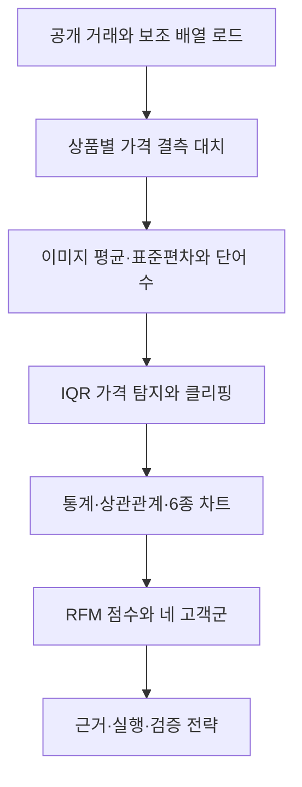
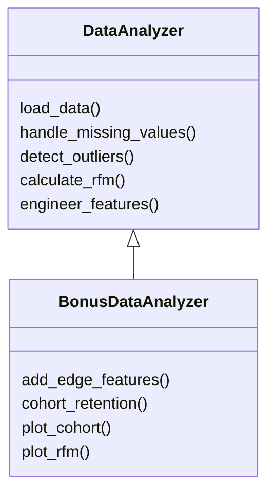
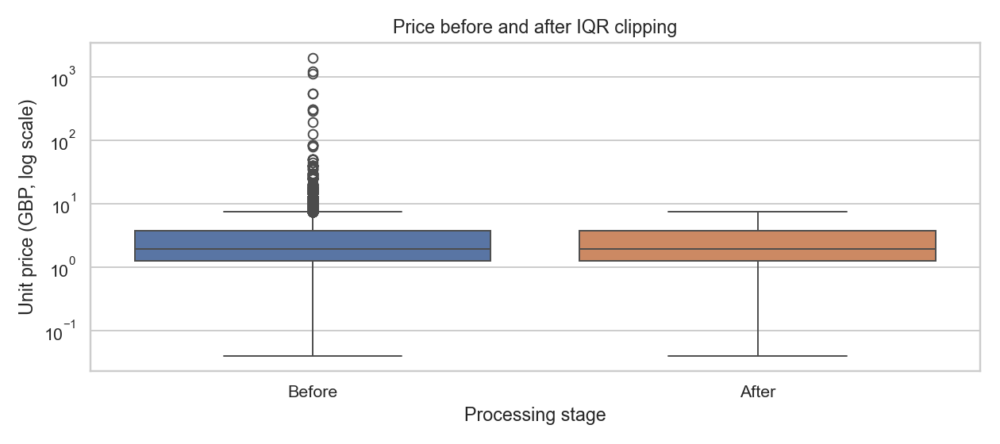

# A1-1 · 쇼핑몰에서 단골 찾기

이번 과제에서는 NumPy와 Pandas로 거래 데이터를 전처리하고 EDA와 RFM 고객 세분화를 구현했다. 분석 로직은 `DataAnalyzer`에 두고, 보너스는 이를 상속한 `BonusDataAnalyzer`로 분리했다. PDF 2쪽에서 요구한 노트북에는 실제 실행 결과와 단계별 해석을 정리했다.

기본 분석에는 **공개 UCI Online Retail 거래**를 사용했다. 원본에 없는 상품 이미지와 가입일은 실제 값처럼 취급하지 않았다. 이미지 계산용 보조 배열과 보너스 가입 코호트용 합성 샘플을 따로 만들고 출처·용도를 구분했다. [데이터 출처와 변환](data/SOURCE.md)에 자세히 기록했다.

## 1. 결과물

| 파일 | 역할 |
|---|---|
| [src/pipeline.py](src/pipeline.py) | 전처리·피처·통계·RFM 기본 클래스 |
| [notebooks/analysis_report.ipynb](notebooks/analysis_report.ipynb) | 실행된 필수 분석 보고서, 6종 차트와 수치 해석 |
| [src/bonus_pipeline.py](src/bonus_pipeline.py) | 상속을 이용한 엣지·코호트·Plotly 확장 |
| [notebooks/bonus_report.ipynb](notebooks/bonus_report.ipynb) | 실행된 보너스 보고서 |
| [docs/code_walkthrough.md](docs/code_walkthrough.md) | 개념·수식·예시와 코드 순차 설명 |
| [docs/code_walkthrough.html](docs/code_walkthrough.html) | 같은 설명의 HTML과 diagram-design 도식 |
| [docs/requirements_review.md](docs/requirements_review.md) | 코드 작성 후 PDF를 다시 대조한 기록 |
| [reports/rfm_interactive.html](reports/rfm_interactive.html) | 오프라인에서 여는 Plotly RFM 차트 |
| [tests](tests/) | 손계산 단위 테스트와 통합 테스트 |

## 2. 데이터와 분석 범위

[UCI Online Retail](https://archive.ics.uci.edu/dataset/352/online%2Bretail)은 Daqing Chen이 공개한 데이터이며 라이선스는 CC BY 4.0이다. CSV 사본의 출처와 원본 SHA-256은 [source_manifest.json](data/source_manifest.json)에 기록했다.

고객을 식별할 수 있는 양의 구매를 대상으로 하고 취소·비양수 수량/단가·완전 중복을 제외했다. 고정 시드 42로 고객 240명을 추출해 해당 고객의 유효 이력을 모두 남겼다.

| 항목 | 분석 입력 |
|---|---:|
| 상품 행 수 | 22,488 |
| 고유 주문 수 | 1,038 |
| 고객 수 | 240 |
| 상품 수 | 2,601 |
| 분석용 열 수 | 10 |
| 기간 | 2010-12-01 ~ 2011-12-09 |
| 양의 구매액 합계 | 521,978.13 GBP |

수치(`price`, `qty`, `amount`), 범주(`country`, `product_id`), 텍스트(`product_name`), 날짜(`order_date`)를 포함한다. 보조 RGB 배열은 `(2601, 8, 8, 3)`이고 `image_index`로 연결했다. 원본 표본 8열은 [retail_source.csv](data/retail_source.csv), 분석용 입력은 [orders.csv](data/orders.csv)이다.

원본 단가에는 결측이 없어 **대치 실습용으로 1,124행(약 5%)을 가렸다.** 같은 상품 ID의 평균으로 채우고 그룹 전체가 비면 전체 평균을 썼다. 그 뒤 IQR로 가격 1,971행(8.76%)을 탐지하고 경계로 제한했다. amount는 원본 단가 × 수량으로 미리 계산했으며 가격 전처리 후 다시 계산하지 않았다. 따라서 고객 주문 이력과 구매액을 보존했다.

가입일은 UCI에 없어 별도 `data/sample/`의 합성 샘플로 가입 월 코호트를 검증했다. 이 샘플은 고객 240명·주문 1,440건·상품 48개이다. 원본 고객의 가입 행동을 분석한 것으로 해석하지 않았다.

## 3. 실행 방법: conda py312

명령은 `A1-1/`에서 실행했다. 확인한 환경은 Python **3.12.2**이며 이 컴퓨터의 py312는 Anaconda 아래에 있다. 기본 conda가 Miniforge를 가리켜 환경을 찾지 못했으므로 실행 경로를 명시했다.

```bash
# 현재 위치가 02_Advanced인 경우
cd A1-1

# 환경 확인
/Users/oliverjoo/Dev/Anaconda/anaconda3/bin/conda run -n py312 python --version

# 전체 테스트
/Users/oliverjoo/Dev/Anaconda/anaconda3/bin/conda run -n py312 python -m unittest discover -s tests -v

# 필수 보고서 실행
/Users/oliverjoo/Dev/Anaconda/anaconda3/bin/conda run -n py312 python scripts/run_notebooks.py

# 필수 + 보너스 보고서 실행
/Users/oliverjoo/Dev/Anaconda/anaconda3/bin/conda run -n py312 python scripts/run_notebooks.py --bonus
```

`run_notebooks.py`는 현재 Python 실행 파일을 Jupyter 커널로 지정한다. 커널·캐시도 `A1-1/.cache/` 아래에 만들었다. 결과는 노트북에 저장하고 CSV·차트는 `reports/`에 남긴다. 이미 실행 출력이 포함되어 있으므로 다시 실행하지 않고 보고서를 검토할 수도 있다.

표본 파일을 포함했으므로 보통 다운로드나 데이터 재생성은 필요 없다. 원본에서 다시 준비할 때만 다음을 실행한다. 다른 컴퓨터에서는 절대 경로를 본인의 conda 경로로 바꾼다.

```bash
conda run -n py312 python -m src.prepare_retail_data
conda run -n py312 python -m src.make_sample_data
```

기존 py312에 필요한 패키지가 있어 추가 설치는 하지 않았다. 환경을 새로 준비할 때만 다음 설치 명령을 사용한다. 설치 위치는 py312로 한정한다.

```bash
conda run -n py312 python -m pip install -r requirements.txt -r requirements-notebook.txt
# 선택 과제 3까지 실행할 경우
conda run -n py312 python -m pip install -r requirements-bonus.txt
```

기본 분석 의존성은 NumPy 1.26.4, Pandas 2.3.3, Matplotlib 3.10.1, Seaborn 0.13.2이다. Plotly 6.3.0은 보너스 3에서만 사용했다. unittest는 표준 라이브러리, Jupyter 관련 패키지는 보고서 실행 도구이다.

## 4. 분석 흐름과 상속 구조





부모 클래스에는 공통 계산만 두었다. 자식 클래스가 데이터와 메서드를 재사용하며 기본 파일은 보너스를 import하지 않는다. 노트북은 계산 클래스를 호출하고 표·차트·해석을 모으는 보고서 역할로 사용했다.

## 5. 전처리와 통계

IQR = Q3 − Q1, 하한 = Q1 − 1.5 × IQR, 상한 = Q3 + 1.5 × IQR이다. 가격 경계는 **−2.50~7.50 GBP**이다. 경계와 같은 값은 정상 범위에 포함했다. `threshold`로 계수를 바꿀 수 있다. 고가 상품도 탐지될 수 있으므로 이상치를 곧바로 오류라고 보지는 않았다.

| 처리 후 변수 | 평균 | 중앙값 | 표본 표준편차 | Q1 | Q3 |
|---|---:|---:|---:|---:|---:|
| 가격(GBP) | 2.640 | 1.95 | 2.125 | 1.25 | 3.75 |
| 수량(개) | 14.136 | 6 | 43.307 | 2 | 12 |
| 상품 행 금액(GBP) | 23.211 | 12.60 | 67.928 | 5.04 | 19.80 |

가격의 중앙 50%는 1.25~3.75 GBP에 있다. 수량의 표준편차 43.307개가 중앙값 6개보다 커서 대량 구매가 분포를 넓히는 점을 확인했다. 행별 금액의 평균 23.211 GBP가 중앙값 12.60 GBP보다 높아 평균 하나로 보통의 구매 행을 설명하기 어렵다.

수량–금액 상관은 **0.669**, 가격–금액은 **0.093**이다. 전자는 상대적으로 강한 선형 연관이지만 amount의 계산식에 수량이 들어간 점을 고려했다. 후자는 가격만 클리핑하고 amount는 원본을 유지한 결과이므로 전처리 영향을 함께 해석했다. 가격–보조 이미지 평균 상관 **−0.056**에는 실제 사진의 사업적 의미가 없다.

근거: [요약 통계](reports/summary_statistics.csv), [상관행렬](reports/correlations.csv).

## 6. 여섯 시각화

차트 제목과 X/Y 축 레이블을 모두 지정했다. 그림은 별도 한글 폰트 설치가 필요 없도록 영어 레이블을 사용하고 해석은 한국어로 작성했다.

| 차트 | 확인한 내용 | 결과 |
|---|---|---|
| 히스토그램 | 처리 후 가격 분포 | [01_histogram.png](reports/figures/01_histogram.png) |
| 박스플롯 | 대치 후 가격의 클리핑 전후(로그 눈금) | [02_boxplot.png](reports/figures/02_boxplot.png) |
| 막대그래프 | 고객군별 인원 | [03_bar.png](reports/figures/03_bar.png) |
| 히트맵 | 수치 변수 상관계수 | [04_heatmap.png](reports/figures/04_heatmap.png) |
| 산점도 | 수량과 원본 행 금액 관계 | [05_scatter.png](reports/figures/05_scatter.png) |
| 라인차트 | 월별 양의 구매액 | [06_line.png](reports/figures/06_line.png) |



마지막 달인 2011년 12월은 9일까지의 자료이다. 마지막 달의 하락을 월 전체 실적 감소로 해석하지 않았다. 표본 고객 240명의 집계이므로 회사 전체 매출과도 구분했다.

## 7. RFM 정의와 결과

기준일은 최종 구매일 **2011-12-09**이다. R은 기준일−고객 마지막 구매일의 일수, F는 고유 주문 번호 수, M은 상품 행 금액 합계이다. 주문 번호가 없는 한 행 한 주문 입력에서는 행 수를 F로 사용한다.

점수는 `ceil(평균 순위 / 고객 수 × 4)`로 정했다. R은 역순, F/M은 정순 순위를 사용해 모두 4점이 좋은 방향이다. 같은 값에는 같은 점수를 주며 점수별 인원을 억지로 균등하게 나누지 않았다.

| 우선순위 | 조건 | 고객군 |
|---|---|---|
| 1 | R > 90일 | Churned |
| 2 | R ≤ 30일, F점수 ≥ 3, M점수 ≥ 3 | VIP |
| 3 | R ≤ 30일, F = 1 | New |
| 4 | 그 외 | Loyal |

Loyal은 나머지 활동 고객군에 붙인 운영상 이름이다. 실제 충성도를 증명하는 라벨은 아니다. 네 그룹은 현재 표본에 모두 존재하며 새 데이터에서도 반드시 존재하도록 강제하지 않았다.

| 고객군 | 인원 | 평균 R(일) | 평균 F(회) | 평균 M(GBP) | 구매액 비중 |
|---|---:|---:|---:|---:|---:|
| VIP | 58 | 11.91 | 10.21 | 6,314.69 | 70.17% |
| Loyal | 90 | 45.12 | 3.27 | 1,210.22 | 20.87% |
| New | 6 | 19.33 | 1.00 | 273.73 | 0.31% |
| Churned | 86 | 212.81 | 1.70 | 525.16 | 8.65% |

F/M은 관측 기간 전체 값이며 월평균이 아니다. 근거는 [rfm.csv](reports/rfm.csv)와 [segments.csv](reports/segments.csv)이다.

## 8. 비즈니스 인사이트: 근거 → 실행 → 검증

다음은 결과를 바탕으로 정리한 실행 제안이다. 실제 고객에게 연락하거나 캠페인을 실행하지 않았고 개선율도 추정하지 않았다.

### 8.1 VIP 유지 실험

- **근거:** VIP 58명(24.17%)의 양의 구매액은 366,252.18 GBP로 표본 전체의 70.17%이고 평균 주문 수는 10.21회이다.
- **실행:** VIP를 대상으로 우선 상담·선출시 안내를 실험군에 제공하고 비교군과 재구매율을 비교한다. 반복 구매와 고객당 구매액 유지가 기대 효과이다.
- **검증:** 혜택 비용·상품 마진·다음 기간 구매액이 필요하다. 매출 유지보다 비용 증가가 크면 수익 개선 가설은 반증될 수 있다.

### 8.2 Churned 재구매 실험

- **근거:** Churned는 86명(35.83%)이고 마지막 구매 후 평균 212.81일이 지났다.
- **실행:** Churned 대상 이탈 이유 설문 후 관심 상품의 재입고 안내를 소규모로 실험한다. 정한 관측 기간 안의 재구매 고객 비율 증가를 기대한다.
- **검증:** 수신 동의·이탈 이유·메시지 노출 데이터가 필요하다. 비교군과 재구매율 차이가 없으면 효과 가설을 기각한다.

### 8.3 New의 두 번째 주문 전환

- **근거:** New는 6명이며 모두 주문 1회, 평균 구매액 273.73 GBP이다.
- **실행:** New 대상 구매 상품 활용 안내와 연관 상품 소개를 제공한다. 첫 구매 뒤 30일 내 두 번째 주문 비율 증가를 기대한다.
- **검증:** 유입 채널·만족도·30일 후 추적 데이터가 필요하다. 현재 표본이 6명뿐이라 효과 검증에는 더 긴 기간 또는 더 큰 표본이 필요하다.

### 8.4 Loyal 구매 간격 실험

- **근거:** Loyal은 90명이고 평균 주문 3.27회, 마지막 구매 후 45.12일이며 구매액 비중은 20.87%이다.
- **실행:** Loyal 대상 상품 사용 주기에 맞춘 재구매 알림을 비교군과 나눠 실험한다. 구매 간격 단축과 유지율 개선을 기대한다.
- **검증:** 상품 소모 주기와 고객별 주문 간격이 필요하다. 내구재의 정상적인 재구매 간격이라면 알림이 효과가 없거나 불편을 줄 수 있다.

## 9. 별도 상속 파일의 보너스

1. **NumPy 엣지:** 가로·세로 인접 픽셀 차이 절댓값 평균을 구했다. 실수형으로 변환해 uint8 뺄셈 순환을 방지했다.
2. **가입 월 코호트:** 별도 합성 샘플에서 가입 월 고객 중 경과 월에 두 번째 이후 구매를 한 고유 고객의 비율을 계산했다. 늦은 첫 구매는 제외하고 미래 월은 NaN으로 가렸다. [히트맵](reports/figures/07_cohort.png), [수치](reports/cohort_retention.csv).
3. **Plotly:** 기본 분석의 UCI 고객군을 색, 구매 횟수를 점 크기로 표시했다. [인터랙티브 결과](reports/rfm_interactive.html)는 외부 CDN 없이 열린다.

보너스 샘플은 모든 가입자에게 구매가 있다. 실제 서비스에서 미구매 가입자가 있다면 별도 회원표를 분모로 사용해야 한다. 코호트는 연속 유지율이나 첫 구매 월 기준 코호트와 구분했다.

## 10. TDD와 요구사항 재검토

손으로 구할 수 있는 기대값을 먼저 작성하고 실패를 확인한 뒤 구현했다. 기본, 보너스, 샘플 통합을 묶음 단위로 진행했으며 공개 거래 적용 때는 다중 상품 행의 구매 빈도 오류를 별도 테스트로 재현했다.

| 단계 | Red | Green |
|---|---|---|
| 기본 | [모듈 부재 실패](reports/tdd_core_red.txt) | [10개 통과](reports/tdd_core_green.txt) |
| 보너스 | [모듈 부재 실패](reports/tdd_bonus_red.txt) | [14개 통과](reports/tdd_bonus_green.txt) |
| 합성 샘플 통합 | [모듈 부재 실패](reports/tdd_sample_red.txt) | [15개 통과](reports/tdd_sample_green.txt) |
| 공개 거래 주문 수 | [기대 1, 실제 2 실패](reports/tdd_retail_red.txt) | [수정 후 통과](reports/tdd_retail_green.txt) |
| 최종 | 단위·두 데이터 통합·기준일 검증 | [18개 통과](reports/tests_final.txt) |

[노트북 실행 기록](reports/notebook_execution.txt)과 [PDF 대조표](docs/requirements_review.md)를 남겼다. 금지된 이미지 처리·머신러닝·자동 EDA 라이브러리를 분석 코드에서 직접 사용하지 않았다. 웹 서비스·DB·모델 학습·배포는 구현하지 않았다.

Git 제외 규칙은 저장소 루트 `.gitignore`에서 관리한다. 전역 `*.csv` 규칙 때문에 제출 데이터가 빠지지 않도록 이 과제의 입력/결과 CSV에는 예외를 추가했다.

PDF의 마지막 제출 단계는 GitHub 저장소 URL 제출이다. 현재 기록한 범위는 로컬 구현·실행 검증이며 원격 업로드와 URL 제출은 남아 있다.
