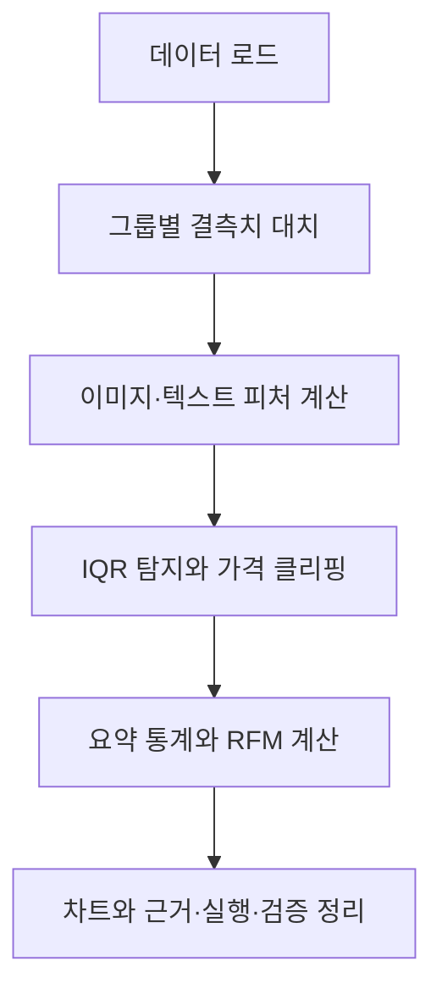

# 쇼핑몰 단골 찾기 · 개념과 구현 설명

이번 과제에서는 거래 내역을 고객 단위로 요약하고, 최근에 자주 구매한 고객을 구분하는 분석을 만들었다. 분석을 시작하기 전에 사용한 개념부터 정리했다. 뒤에서는 실제 작성한 코드 순서대로 입력, 처리 방식, 결과와 테스트를 설명한다.

기본 분석은 UCI Online Retail의 고객 240명 표본을 사용했다. 상품 행 22,488개에 주문 1,038개가 들어 있다. 원본에 없는 이미지는 보조 픽셀 배열로, 가입 코호트는 별도 합성 샘플로 계산했다. 실제 거래와 보조 샘플의 경계는 [출처](../data/SOURCE.md)에 기록했다.

## 1. 구현 전에 정리한 개념

### 1.1 행, 열, 자료형과 DataFrame

엑셀 표를 생각하면 한 행은 하나의 기록, 한 열은 기록의 속성이다. 공개 거래의 한 행은 주문 안의 상품 한 종류이고, 같은 주문 번호가 여러 행에 걸칠 수 있다. 열에는 고객 ID·단가·수량·금액·구매일 등이 들어 있다. Pandas의 `DataFrame`은 이런 표를 Python에서 다루는 자료형이다.

현실 예시로 고객 A가 컵 2개를 10,000원에 산 주문에는 고객 ID, 상품명, 수량, 결제액이 함께 기록된다. 고객 A가 다시 주문하면 같은 고객 ID를 가진 새로운 행이 추가된다. 고객 수와 주문 수는 다르다.

`order_date`가 문자열인 채로 남아 있으면 일수 계산이 어렵기 때문에 날짜형으로 변환했다. 이미지는 표의 한 칸에 문자열로 넣지 않고 별도 NumPy 배열에 저장하고 `image_index`로 연결했다.

관련 코드: [load_data](../src/pipeline.py#L16), [샘플 컬럼 생성](../src/make_sample_data.py). 활용 사례는 고객별 집계, 월별 매출, 결측치 탐색이다.

### 1.2 클래스, 객체, self와 상속

클래스는 데이터와 그 데이터를 처리하는 동작을 묶은 설계도이다. `DataAnalyzer`의 객체에는 거래표 `self.df`와 이미지 배열 `self.images`가 있다. `self`는 지금 메서드를 실행하는 객체 자신을 뜻한다.

매장별 분석 담당자를 하나씩 둔다고 생각했다. 매장 A의 분석 객체와 매장 B의 분석 객체는 같은 메서드를 사용하지만 서로 다른 거래표를 가진다. 파일을 읽고 대치한 결과를 같은 객체에 보관하면 함수마다 파일을 다시 읽을 필요가 없다.

상속은 기존 클래스의 데이터와 메서드를 물려받는 방법이다. `BonusDataAnalyzer(DataAnalyzer)`로 기본 분석을 재사용하고 엣지·코호트·Plotly만 추가했다. 기본 분석 파일에 선택 과제 코드를 섞지 않기 위한 선택이다.

관련 코드: [DataAnalyzer](../src/pipeline.py#L7), [BonusDataAnalyzer](../src/bonus_pipeline.py#L9). 활용 사례는 공통 전처리를 유지하면서 분석 종류만 확장하는 경우이다.

### 1.3 NumPy 배열, 축과 벡터 연산

배열은 같은 종류의 값을 여러 차원으로 담은 자료구조이다. RGB 이미지 한 장은 높이 × 너비 × 3개의 채널로 나타낼 수 있다. 기본 분석의 보조 배열 크기는 `(2601, 8, 8, 3)`이다. 보너스 합성 샘플 배열은 `(48, 8, 8, 3)`이다. 첫 축은 상품, 나머지 축은 높이·너비·색상이다.

벡터 연산은 Python에서 픽셀을 하나씩 꺼내 반복하는 대신 배열 전체에 연산을 적용하는 방식이다. `images.mean(axis=(1, 2, 3))`은 각 이미지 안의 세 축을 평균내고 상품 축 2,601개만 남긴다. 결과는 2,601개의 평균값이다. `image_index`로 이를 상품 행 22,488개에 연결한다.

현실 예시로 사진 여러 장의 평균 밝기를 비교할 때 사용할 수 있다. 모든 픽셀이 10인 사진의 평균은 10이고 표준편차는 0이다. 다만 RGB 채널의 단순 평균은 사람 눈의 밝기 감도를 반영한 휘도가 아니다.

관련 코드: [engineer_features](../src/pipeline.py#L36). 활용 사례는 이미지별 통계 피처 계산이며, 물체 인식이나 분류 모델을 구현한 것은 아니다.

### 1.4 평균, 중앙값, 표준편차와 사분위수

평균은 값을 모두 더해 개수로 나눈 값이다. 중앙값은 정렬했을 때 가운데 값이다. `[10, 20, 30]`의 평균과 중앙값은 모두 20이다. `[10, 20, 300]`에서는 평균은 110이지만 중앙값은 20이어서 극단값의 영향을 비교할 수 있다.

```text
평균 μ = Σxᵢ / n
모집단 표준편차 σ = √(Σ(xᵢ − μ)² / n)
표본 표준편차 s = √(Σ(xᵢ − x̄)² / (n − 1))
Q1 = 25% 분위수, Q2 = 중앙값, Q3 = 75% 분위수
```

Σ는 모든 항을 더한다는 뜻이고 n은 값의 개수이다. 표준편차는 평균에서 얼마나 퍼져 있는지를 나타낸다. `[0, 2, 4, 6]`의 평균은 3, 모집단 분산은 5, 모집단 표준편차는 √5 ≈ 2.236이다.

이미지의 전체 픽셀을 대상으로 할 때는 `ddof=0`을 썼다. 주문 통계에서는 Pandas 기본 표본 표준편차인 `ddof=1`을 사용했다. 사분위수는 Pandas 기본 선형 보간 방식을 따른다.

관련 코드: [이미지 통계](../src/pipeline.py#L36), [summary_statistics](../src/pipeline.py#L62), [손계산 테스트](../tests/test_pipeline.py). 활용 사례는 대표 가격과 가격 변동 폭을 함께 설명하는 경우이다.

### 1.5 결측치와 그룹별 대치

결측치는 값이 기록되지 않은 상태이다. 값 0과는 다르다. 가격이 없는 상품 행을 모두 삭제하면 거래 내용이 줄어들기 때문에 같은 그룹의 대표값으로 채우기로 했다. 기본 분석에서는 상품 ID를 그룹으로 사용했고, 아래 예시에서는 이해하기 쉽게 카테고리로 묶었다.

예를 들어 생활용품 가격이 `[10, NaN]`, 전자제품 가격이 `[30, 50]`이라면 생활용품 결측은 생활용품 평균 10으로 채운다. 전체 평균 30을 쓰면 카테고리의 가격 차이를 반영하지 못한다.

```text
결측 가격 대치값 = 같은 카테고리의 관측 가격 평균
그룹 전체가 결측이면 = 전체 관측 가격 평균
```

`groupby().transform('mean')`은 집계 결과를 원래 행 수에 맞춰 돌려준다. 그래서 `fillna()`에 바로 넣을 수 있다. 평균은 이상치에 민감하므로 `strategy='median'`도 선택할 수 있게 했다. 열 전체가 결측이면 이 방법만으로는 복구할 수 없다.

관련 코드: [handle_missing_values](../src/pipeline.py#L27). 활용 사례는 상품 카테고리처럼 비교 가능한 그룹 안에서 누락값을 채우는 경우이다.

### 1.6 IQR 이상치와 클리핑

이상치는 다른 값에 비해 유난히 크거나 작은 값이다. 반드시 오류라는 뜻은 아니다. 실제 고가 상품도 이상치로 표시될 수 있다.

```text
IQR = Q3 − Q1
하한 L = Q1 − k × IQR
상한 U = Q3 + k × IQR
이상치 조건: x < L 또는 x > U
클리핑 결과: min(max(x, L), U)
```

`[0, 1, 2, 3, 100]`에서는 Q1=1, Q3=3, IQR=2이다. k=1.5라면 경계는 −2와 6이고, 100만 이상치이다. 이를 클리핑하면 6이 된다. 값이 정확히 6이라면 이상치로 판정하지 않는다.

이번 분석에서는 원본을 보관하고 메모리의 가격만 제한했다. 고객의 결제액까지 바꾸면 RFM의 M이 달라지므로 `amount`는 유지했다.

관련 코드: [iqr_bounds와 detect_outliers](../src/pipeline.py#L46), [handle_outliers](../src/pipeline.py#L56). 활용 사례는 극단값이 분포 요약을 압도하는지 비교하는 경우이다.

### 1.7 상관계수와 인과관계

Pearson 상관계수는 두 숫자 변수가 선형으로 함께 움직이는 정도이다. −1에서 1 사이이며 1에 가까우면 같은 방향, −1에 가까우면 반대 방향, 0에 가까우면 뚜렷한 선형 관계가 약하다. 0이 모든 형태의 관계가 없다는 뜻은 아니다.

```text
r = Σ[(xᵢ − x̄)(yᵢ − ȳ)]
    / √(Σ(xᵢ − x̄)² × Σ(yᵢ − ȳ)²)
```

현실 예시로 아이스크림 판매량과 냉방 사용량이 함께 늘어도 아이스크림이 냉방 사용을 일으킨다고 할 수는 없다. 더운 날씨라는 공통 원인이 있을 수 있다.

공개 거래 표본에서 수량–행 금액 상관은 0.669이다. 결제액을 단가 × 수량으로 만들었기 때문에 생기는 관계가 포함돼 있다. 이미지는 원본 사진이 아닌 보조 배열이므로 가격과의 상관을 마케팅 효과로 해석하지 않았다.

관련 코드: [기본 노트북 5절](../notebooks/analysis_report.ipynb), [상관행렬 결과](../reports/correlations.csv). 활용 사례는 함께 살펴볼 변수를 찾는 탐색 단계이다.

### 1.8 RFM 값, 점수와 세그먼트

RFM은 “얼마나 최근에, 얼마나 자주, 얼마나 많이 샀는가”를 고객별로 정리한 것이다. R은 작을수록 최근 고객이고, F/M은 클수록 주문과 금액이 많다.

```text
R = 기준일 − 고객의 마지막 주문일 (일)
F = 고객의 고유 주문 번호 수 (회)
M = 고객의 결제액 합 (원)
점수 = ceil(평균 순위 / 전체 고객 수 × 4)
```

예를 들어 기준일이 1월 10일이고 A가 1월 1일 10원, 1월 10일 20원을 샀다면 R=0, F=2, M=30이다. `ceil`은 올림이다. R은 역순으로 순위를 구해 작은 R이 높은 점수를 받게 했다. 같은 값은 평균 순위를 쓰므로 같은 점수를 받는다.

이 점수는 학습된 AI 모델이 아니다. 정한 규칙에 따라 비교하기 쉬운 숫자로 바꾼 것이다. VIP 조건은 R≤30일이며 F/M 점수가 각각 3 이상이다. R>90일이면 먼저 Churned로 분류한다.

관련 코드: [calculate_rfm](../src/pipeline.py#L68), [segment_customers](../src/pipeline.py#L88). 활용 사례는 고객군별로 다른 유지·재구매 실험을 설계하는 경우이다.

### 1.9 코호트와 재구매율

코호트는 같은 시기에 출발한 사람들의 집단이다. 이번에는 가입 월이 같은 고객을 묶었다. 가입일과 첫 구매일은 다르므로 두 날짜를 구분했다.

```text
가입 후 경과 월 = 주문 월 번호 − 가입 월 번호
월별 재구매율 = 그 달에 두 번째 이후 주문을 한 고객 수
               / 해당 가입 월 전체 고객 수
```

1월 가입자가 2명이고 2월에 한 명만 재구매했다면 재구매율은 1/2=50%이다. 나머지 한 명이 2월에 처음 구매했다면 그 사람은 재구매자에 포함하지 않는다. 주문 횟수가 아니라 고유 고객 수를 분자로 사용한다.

미래라 아직 관측하지 못한 달은 0% 대신 NaN으로 남겼다. 샘플은 모든 가입자에게 구매가 있으므로 거래표로 분모를 계산했지만, 실제 서비스에는 미구매자를 포함한 회원표가 필요하다.

관련 코드: [cohort_retention](../src/bonus_pipeline.py#L21), [보너스 테스트](../tests/test_bonus.py). 활용 사례는 가입 시기별 재구매 행동을 같은 경과 월에서 비교하는 경우이다.

### 1.10 TDD: 기대값을 먼저 정하기

TDD는 먼저 테스트로 기대 동작을 쓰고 실패를 확인한 뒤, 구현하여 통과시키고 구조를 정리하는 순서이다. Red는 실패, Green은 통과, Refactor는 동작을 유지한 정리 단계이다.

이 과제에서는 기본 기능, 보너스, 샘플 통합을 먼저 진행하고 공개 거래의 주문 수 처리도 별도 테스트로 보완했다. 각 묶음에서 모듈이 없는 상태의 실패를 먼저 저장하고 구현 후 통과를 확인했다. 테스트 하나씩 커밋을 나눈 방식은 아니다.

현실 예시로 계산기를 만들 때 `2 + 3 = 5`를 먼저 검증하는 것과 같다. 여기서는 이미지 `[0,2,4,6]`의 평균 3과 표준편차 √5, 고객 A의 R/F/M=0/2/30처럼 손으로 구할 수 있는 값을 기준으로 삼았다.

관련 코드: [기본 테스트](../tests/test_pipeline.py), [보너스 테스트](../tests/test_bonus.py), [샘플 통합 테스트](../tests/test_sample.py). 활용 사례는 라이브러리 사용법을 잘못 이해해도 결과값으로 오류를 발견하고 수정 후 회귀를 확인하는 경우이다.

## 2. 전체 분석 순서



기본 계산은 `src/pipeline.py`에 두었다. PDF 2쪽이 요구한 `notebooks/analysis_report.ipynb`에는 메서드 실행, 표와 차트, 수치 해석을 담았다. 노트북에만 계산 로직을 숨기지 않고 `.py`를 직접 테스트할 수 있도록 나눴다.

## 3. 코드 순서대로 설명

### 3.1 공개 거래와 보조 샘플 준비

코드: [prepare_retail_data](../src/prepare_retail_data.py), 출처: [SOURCE.md](../data/SOURCE.md).

UCI Online Retail CSV 사본을 읽어 고객/상품명 누락, 취소, 비양수 수량/단가와 완전 중복을 제외했다. 시드 42로 고객 240명을 선택하고 해당 고객의 유효 구매 이력을 모두 남겼다. 상품 행 단위로 임의 추출하면 고객의 구매 횟수가 왜곡될 수 있어 고객 단위로 추출했다.

원본 표본은 `retail_source.csv`로 보관했다. 분석용 CSV는 열 이름을 바꾸고 `amount = 원본 UnitPrice × Quantity`를 추가했다. 단가 결측 대치를 실습하려고 가격 1,124개를 가렸지만 원본 가격과 amount는 보존했다. 실제로 없던 결측을 원본 품질 문제라고 설명하지 않았다.

원본에는 이미지와 가입일이 없다. 이미지 배열 계산은 상품별 보조 픽셀 배열로 검증했고, 가입 월 코호트는 [make_sample_data](../src/make_sample_data.py)가 만든 별도 합성 자료로 구현했다. 공개 거래의 첫 구매일을 가입일로 대체하지 않았다.

평가 포인트: [test_sample.py](../tests/test_sample.py)는 공개 원본 금액과 분석 입력 amount의 일치, 주문 수/금액 보존, 네 고객군과 보조 샘플 재현성을 검증한다.

### 3.2 객체 생성과 로드

코드: [생성자와 load_data](../src/pipeline.py#L10).

```python
analyzer = DataAnalyzer('data/orders.csv', 'data/images.npy')
raw = analyzer.load_data().copy()
```

생성자에는 경로를 저장하고 실제 읽기는 `load_data()`에서 수행한다. CSV 날짜를 변환하고 `np.load(..., allow_pickle=False)`로 배열을 읽는다. 원본과 처리 후 결과를 비교하려고 노트북에서 `copy()`를 사용했다.

`info()`로 자료형과 결측 개수, `head()`로 열 연결 상태, `describe()`로 수치 범위를 확인했다. 가린 가격 1,124개가 결측으로 표시되는지와 날짜형 변환을 확인했다. 주문 번호는 1,038개지만 행은 22,488개여서 구매 빈도 집계 단위를 구분했다.

### 3.3 결측 현황과 대치

코드: [missing_summary / handle_missing_values](../src/pipeline.py#L24).

```python
group_values = self.df.groupby(group_col)[column].transform(strategy)
fallback = self.df[column].agg(strategy)
self.df[column] = self.df[column].fillna(group_values).fillna(fallback)
```

기본 보고서에서는 같은 상품 ID 평균을 쓰고 그래도 비는 행에 전체 평균을 적용했다. `mean`과 `median`만 허용해 잘못된 전략 이름은 오류로 알린다. 가격 결측 1,124개가 0개로 줄어드는지 노트북과 통합 테스트에서 확인했다.

### 3.4 이미지와 상품명 피처

코드: [engineer_features](../src/pipeline.py#L36).

```python
axes = tuple(range(1, images.ndim))
self.df['image_mean'] = images.mean(axis=axes)[image_index]
self.df['image_std'] = images.std(axis=axes, ddof=0)[image_index]
```

`range`는 평균을 낼 축 번호를 만드는 용도이며 픽셀별 반복문이 아니다. 이미지 통계를 상품별 한 번 계산하고 인덱스로 주문에 연결했다. `str.split().str.len()`으로 단어 수도 구했다. 테스트에서는 이미지 인덱스를 일부러 뒤섞어 잘못된 행에 통계가 붙는 오류를 확인했다.

### 3.5 IQR 탐지와 처리 전후 비교

코드: [IQR 관련 메서드](../src/pipeline.py#L46), 그림: [박스플롯](../reports/figures/02_boxplot.png).

경계 계산을 `iqr_bounds()`로 분리하고 탐지와 클리핑이 같은 경계를 사용하게 했다. 경계 −2.50~7.50 GBP 밖의 1,971행을 찾고 가격을 제한했다. 박스플롯은 대치 후·클리핑 전 가격과 클리핑 후 가격을 비교한다. 결측이 남은 원본 가격과의 비교는 아니다. 큰 극단값 때문에 박스가 눌리지 않도록 가격 축만 로그 눈금으로 표시했다.

평가 포인트: 경계와 같은 값은 정상, IQR=0인 경우에도 다른 값은 탐지, 임계값을 키우면 탐지 결과 변경, 결제액 불변을 각각 테스트했다.

### 3.6 통계와 차트

코드: [summary_statistics](../src/pipeline.py#L62), [노트북 5절](../notebooks/analysis_report.ipynb).

`agg()`로 평균·중앙값·표준편차를 모으고 `quantile()`로 Q1/Q3를 추가했다. 가격 표본 표준편차는 2.125 GBP이다. 평균 2.640 GBP와 함께 보면 대표 가격 주위의 변동 폭도 설명할 수 있다.

히스토그램·박스플롯·막대·히트맵·산점도·라인차트 각 1개를 만들었다. 차트 제목과 X/Y 축 이름을 지정하고 PNG로 저장했다. RFM 이전의 상관행렬과 월별 매출도 CSV로 남겨 문서의 수치를 다시 확인할 수 있게 했다.

### 3.7 RFM 계산과 분류

코드: [calculate_rfm / segment_customers](../src/pipeline.py#L68), 결과: [rfm.csv](../reports/rfm.csv).

고객별 최종 거래일·고유 주문 번호 수·상품 행 금액 합계를 계산했다. 주문 번호가 없는 한 행 한 주문 입력에서는 행 수를 사용한다. 기준일을 생략하면 최종 거래일을 사용한다. 기준일이 최종 거래일보다 빠르면 음수 R이 생기므로 오류를 내도록 했다.

최근 고객의 R 점수가 높도록 역순 순위를 쓰고, F와 M은 정순으로 계산했다. 분류 순서를 두어 오래전에 많이 샀던 고객도 R>90이면 먼저 Churned에 속하게 했다. 공개 거래에서는 VIP 58명, Loyal 90명, New 6명, Churned 86명이었다. 코드가 그룹별 고객 수를 균등하게 맞추지는 않는다.

분류 결과는 VIP 평균 F=10.21회, M=6,314.69 GBP, Loyal 평균 R=45.12일, New 평균 F=1회, Churned 평균 R=212.81일이었다. 이를 근거로 [README의 네 가지 실험 제안](../README.md#8-비즈니스-인사이트-근거--실행--검증)을 정리했다. 캠페인은 실행하지 않았다.

### 3.8 보너스를 상속으로 분리

코드: [BonusDataAnalyzer](../src/bonus_pipeline.py), 보고서: [bonus_report.ipynb](../notebooks/bonus_report.ipynb).

`BonusDataAnalyzer`는 부모 클래스의 생성자와 전처리/RFM 메서드를 그대로 사용한다. 추가한 메서드는 `add_edge_features`, `cohort_retention`, `plot_cohort`, `plot_rfm` 네 개이다.

엣지는 가로·세로 방향에서 픽셀 차이의 절댓값을 평균낸 값이다. `[[255,0],[255,0]]`의 가로 차이는 255, 세로 차이는 0이므로 최종 값은 127.5이다. 실수형 변환을 빼먹으면 uint8 순환 때문에 이 값이 달라진다.

코호트에서는 날짜순 정렬 후 `groupby('customer_id').cumcount()>0`으로 두 번째 이후 주문을 골랐다. 같은 고객이 한 달에 여러 번 구매해도 `nunique()`로 한 명만 센다. 미래 월은 마스크로 비웠다.

코호트와 엣지는 별도 합성 샘플로 계산하고, Plotly는 기본 분석과 같은 공개 거래 RFM에 적용했다. Plotly는 `plot_rfm()` 안에서만 import했다. 기본 분석만 실행할 때에는 Plotly가 필요 없다. 결과 HTML에는 Plotly 코드가 포함되어 오프라인에서도 범례와 마우스 정보 표시를 사용할 수 있다.

## 4. 검증 결과와 평가할 때 확인할 점

| 확인 항목 | 기대값 또는 결과 | 근거 |
|---|---|---|
| 이미지 통계 | 평균 3, 표준편차 √5 | [기본 테스트](../tests/test_pipeline.py) |
| IQR | `[0,1,2,3,100]`의 상한 6 | [기본 테스트](../tests/test_pipeline.py) |
| RFM | 고객 A의 R/F/M = 0/2/30 | [기본 테스트](../tests/test_pipeline.py) |
| 동점 | 같은 F/M에는 같은 점수 | [기본 테스트](../tests/test_pipeline.py) |
| 재구매 | 늦은 첫 구매 제외, 1/2=50% | [보너스 테스트](../tests/test_bonus.py) |
| 이미지 뺄셈 | uint8 오류 없이 엣지 127.5 | [보너스 테스트](../tests/test_bonus.py) |
| 공개 거래 분석 | 상품 행 22,488개, 주문 1,038개, 금액 521,978.13 GBP 보존 | [샘플 테스트](../tests/test_sample.py) |
| 최종 테스트 | 18개 통과 | [실행 기록](../reports/tests_final.txt) |
| 노트북 | 기본/보너스 모두 py312에서 실행 | [실행 기록](../reports/notebook_execution.txt) |

Red 로그는 구현 파일이 없어서 발생한 실제 import 실패이고, 통과 로그로 덮어쓰지 않았다. 공개 거래를 적용할 때 같은 주문의 상품 2행을 F=2로 세는 실패를 먼저 재현한 뒤 고유 주문 수로 수정했다. 저장된 차트와 설명 HTML은 계산 테스트와 별도로 확인했다.

## 5. 범위와 남은 한계

공개 거래에서는 취소·비양수 거래를 제외하고 여러 상품 행의 주문 번호를 고유 집계했다. 따라서 amount는 환불 차감 순매출이 아니다. 서로 다른 크기의 이미지나 이미지 누락 처리는 추가하지 않았다. 보너스 가입 코호트는 모든 가입자에게 주문이 있는 별도 합성 샘플에 한정했다. 실제 가입자 유지율을 구하려면 가입자 원장이 필요하다.

보너스의 엣지 값은 단순한 픽셀 변화량이며 이미지 의미를 추출하는 학습 모델이 아니다. 코호트 재구매율은 “매달 연속 구매한 비율”도 아니고 “첫 구매 월 기준 유지율”도 아니다. 해당 가입 월 고객 중 그 달에 재구매한 비율로 정의했다.

PDF의 최종 제출은 GitHub 저장소 URL이다. 현재 확인한 것은 로컬 구현과 실행 결과까지이며 원격 업로드는 별도 제출 단계로 남아 있다.
