# A2-1 · AI가 어떻게 학습하는지 수학으로 직접 풀어보기

행렬이 좌표를 바꾸는 과정부터 신경망의 역전파, 경사하강법, 손실 함수의 확률적 의미까지 NumPy로 계산했다. PDF의 고정 예제와 오차 기준을 테스트로 정리하고, 구현 후 실제 실행 결과와 PDF 요구사항을 다시 대조했다. 수학 계산은 NumPy, 그래프는 Matplotlib을 사용했다. 실행 환경은 conda **py312 / Python 3.12.2**다.

## 1. 구현 범위와 읽는 순서

| 영역 | 구현·실험 | 산출물 |
|---|---|---|
| 선형대수 | 회전·스케일링·전단, 행렬식과 면적비, 직접 Power Iteration, SVD 복원 | [linear_algebra.py](src/linear_algebra.py) |
| 미적분 | 중심차분, 등고선과 기울기 | [calculus.py](src/calculus.py) |
| 역전파 | 2→2→1, 고정 입력, 여섯 미분·shape·4자리 검증 | [backprop_derivation.ipynb](notebooks/backprop_derivation.ipynb), [계산 코드](src/backprop.py) |
| 최적화 | VanillaGD/Momentum, 원형·타원형 경로, 학습률 비교 | [optimizer.py](src/optimizer.py) |
| 확률·손실 | 정규 PDF, 베르누이 PMF, Softmax, MSE/CE와 MLE | [probability_loss.ipynb](notebooks/probability_loss.ipynb), [확률 코드](src/probability.py) |
| 보너스 | Adam/Newton/정보 이론, 기본 클래스 상속 | [bonus_report.ipynb](notebooks/bonus_report.ipynb) |

처음 보는 개념은 [개념·수식·코드 설명](docs/code_walkthrough.md)을 먼저 읽고, 이 README의 실행 방법과 결과를 확인하면 된다. [PDF 재검토](docs/requirements_review.md)는 요구사항별 증거와 예시의 수학적 차이를 정리한 문서다. 브라우저용 문서는 [README 전용 HTML](README.html)과 설명·README·재검토를 한 파일에 담은 [통합 설명 HTML](docs/code_walkthrough.html)이다.

## 2. 작업과 검증 흐름

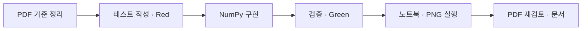

필수 테스트는 구현 파일이 없는 상태에서 실패하는 것을 확인했다. 구현 후 18개 필수 테스트가 통과했고, 보너스까지 포함한 최종 검사는 **27개 통과**다. 역전파는 독립 손계산의 반올림 값뿐 아니라 모든 파라미터의 중심차분과도 비교했다. 테스트와 실제 로그는 [tests](tests/test_core.py), [보너스 테스트](tests/test_bonus.py), [reports](reports/tdd_all_green.txt)에 있다. 보너스 첫 실행과 후속 Red/Green의 실제 순서는 [재검토 문서](docs/requirements_review.md#8-tdd-기록과-작업-범위)에 기록했다.

## 3. 파일 구조

```text
A2-1/
├── A2-1*.pdf                        원본 과제 문서
├── README.md / README.html          실행·결과 안내
├── requirements.txt                py312에서 확인한 사용 버전
├── src/
│   ├── linear_algebra.py            변환·Power Iteration·SVD
│   ├── calculus.py                  중심차분·기울기 그림
│   ├── backprop.py                  고정 신경망의 연쇄 법칙
│   ├── optimizer.py                 VanillaGD·Momentum
│   ├── probability.py               분포·Softmax
│   ├── bonus_optimizer.py           Adam·Newton, 상속
│   └── bonus_probability.py         정보 이론, 상속
├── tests/                          필수·보너스 unittest
├── notebooks/                      필수 2개 + 별도 보너스 1개
├── data/                           공개 PGM 원본·64×64 입력·출처
├── outputs/                        필수 PNG 11개 + 보너스 PNG 4개
├── reports/                        수치 JSON·TDD·실행·검수 기록
├── docs/                           설명 MD/HTML·요구사항 재검토
├── scripts/                        입력 준비·실험·노트북·HTML 재생성
└── .cache/                         폰트·커널·브라우저 검수 캐시
```

보너스는 필수 파일을 수정해 끼워 넣지 않고 별도 모듈의 상속으로 구현했다. 모든 결과와 캐시는 A2-1 및 하위 폴더에 저장한다. 폴더별 `.gitignore`를 추가하지 않았으며 저장소 루트의 기존 캐시 제외 규칙을 사용한다.

## 4. py312에서 실행

명령은 **A2-1 폴더에서** 실행한다. 이 머신의 py312는 Anaconda에 있으므로 다른 conda 설치의 동명 환경과 혼동하지 않도록 경로를 명시했다. 아래 명령의 `rtk proxy`는 이 저장소의 명령 실행 규칙을 따른다.

```bash
cd /Users/oliverjoo/Dev/codyssey/2026/codyssey_missions/AI_SW/02_Advanced/A2-1

# 환경과 설치된 사용 버전 확인
rtk proxy /Users/oliverjoo/Dev/Anaconda/anaconda3/bin/conda run -n py312 python --version

# 원본에서 64×64 입력 재생성 (다운로드 없이 로컬 원본 사용)
rtk proxy /Users/oliverjoo/Dev/Anaconda/anaconda3/bin/conda run -n py312 python scripts/prepare_image.py

# 필수 테스트
rtk proxy /Users/oliverjoo/Dev/Anaconda/anaconda3/bin/conda run -n py312 python -m unittest discover -s tests -p test_core.py -v

# 전체 테스트: 필수 18 + 보너스 9
rtk proxy /Users/oliverjoo/Dev/Anaconda/anaconda3/bin/conda run -n py312 python -m unittest discover -s tests -v

# 필수 PNG와 수치 JSON 재생성
rtk proxy /Users/oliverjoo/Dev/Anaconda/anaconda3/bin/conda run -n py312 python scripts/run_experiments.py

# 보너스까지 포함한 실험
rtk proxy /Users/oliverjoo/Dev/Anaconda/anaconda3/bin/conda run -n py312 python scripts/run_experiments.py --bonus

# 필수 노트북 실행; --bonus를 붙이면 보너스 노트북도 실행
rtk proxy /Users/oliverjoo/Dev/Anaconda/anaconda3/bin/conda run -n py312 python scripts/run_notebooks.py --bonus

# Markdown을 기반으로 HTML 재생성
rtk proxy /Users/oliverjoo/Dev/Anaconda/anaconda3/bin/conda run -n py312 python scripts/build_html.py
```

수학 실험은 NumPy와 Matplotlib만 사용한다. `nbformat`, `nbclient`, `ipykernel`, `jupyter-client`는 노트북 실행 도구이고 `Markdown`, `beautifulsoup4`는 문서 변환 도구다. 현재 py312에 필요한 라이브러리가 이미 있어 패키지를 새로 설치하지 않았다. 별도 환경에서 누락되었을 때만 **py312에** 설치한다.

```bash
rtk proxy /Users/oliverjoo/Dev/Anaconda/anaconda3/bin/conda run -n py312 python -m pip install -r requirements.txt
```

노트북 실행기는 사용한 Python 경로를 커널 argv에 직접 기록한다. 전역 Jupyter 커널을 등록하지 않는다. Jupyter 커널의 로컬 통신 포트를 막는 샌드박스에서는 해당 노트북 실행 명령의 권한 허용이 필요하다. HTML은 브라우저에서 파일을 직접 열며, 수식·도식·PNG가 한 파일에 들어 있어 렌더링에 네트워크가 필요 없다.

산출물의 링크·노트북 실행 상태·버전·Docstring은 다음 명령으로 검수한다.

```bash
rtk proxy /Users/oliverjoo/Dev/Anaconda/anaconda3/bin/conda run -n py312 python scripts/verify_artifacts.py
```

## 5. 데이터와 재현성

행렬 변환의 입력은 `np.linspace(0, 2*np.pi, 100)`으로 만든 단위 원이다. 최적화는 PDF의 `x²+y²`, `x²+10y²`와 초기점 `(5,5)`를 사용한다. 모든 실험과 노트북에 `np.random.seed(42)`를 명시했다.

이미지는 John Burkardt의 [공개 PGMA 샘플](https://people.math.sc.edu/Burkardt/data/pgma/pgma.html) 중 Baboon 흑백 이미지를 사용했다. 공개 원본 512×512를 `[::8, ::8]`로 선택해 실제 SVD 입력을 **64×64**로 만들고 헤더의 최대 회색값으로 나눴다. 원본과 전처리 배열을 함께 보존하여 네트워크 없이 재실행할 수 있다. [출처·라이선스·전처리](data/SOURCE.md)와 [SHA-256 메타데이터](data/source_metadata.json)를 확인할 수 있다.

## 6. 선형대수와 미적분 결과

점의 열벡터에 행렬을 곱하는 식은 `p'=A p`다. 점을 행으로 모은 배열에는 `points @ matrix.T`를 사용했다. 면적은 신발끈 공식으로 독립 측정했으며 면적비는 `|det(A)|`와 비교했다.

| 항목 | 실제 결과 | PDF 기준 |
|---|---|---|
| 회전 45° | 단위 원 유지, 방향 표시 반지름선 회전 | 전후 겹쳐 출력 |
| 스케일링 (2,.5) | 가로 2배, 세로 .5배, 면적 유지 | 타원 출력 |
| 전단 k=.8 | x'=x+.8y, 면적 유지 | 기울어진 형태 |
| 면적비 오차 | 세 변환 모두 0% | ≤1% |
| Power Iteration | λ=4.618033988749502, v≈[.85065059,.52573147], 20회 | 직접 구현 |
| eig 비교 상대 오차 | 8.50×10⁻¹²% | ≤5% |
| x²의 x=3 중심차분 | 6.000000000039306, 절대 오차 3.93×10⁻¹¹ | ≤1e-4 |
| Gradient와 접선 내적 | 최대 절댓값 1.78×10⁻¹⁵ | 등고선에 수직 |

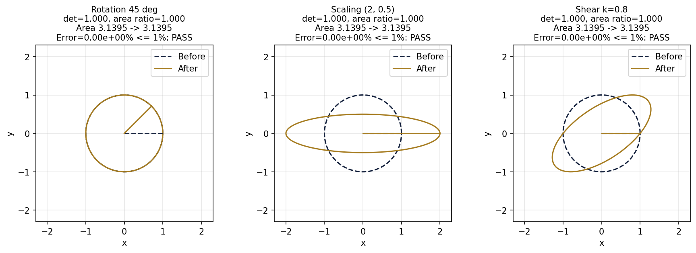

Power Iteration은 `v←Av/||Av||`를 반복하고 `λ=vᵀAv`로 값을 추정했다. 검증 행렬은 `[[4,1],[1,3]]`이다. `np.linalg.eig`는 테스트와 실행 스크립트의 비교 코드에서만 호출했다. 알고리즘은 절댓값이 가장 큰 고유값을 찾으며, 이 양의 대칭 행렬에서는 최대 고유값과 일치한다.

| 요청 k | 실제 k | 복원 MSE | 저장 인자 수 / 원본 값 수 |
|---|---|---|---|
| 10 | 10 | .009078436 | 1290 / 4096 |
| 50 | 50 | .000090186 | 6450 / 4096 |
| 100 | 64 | 2.90×10⁻³¹ | 8256 / 4096 |

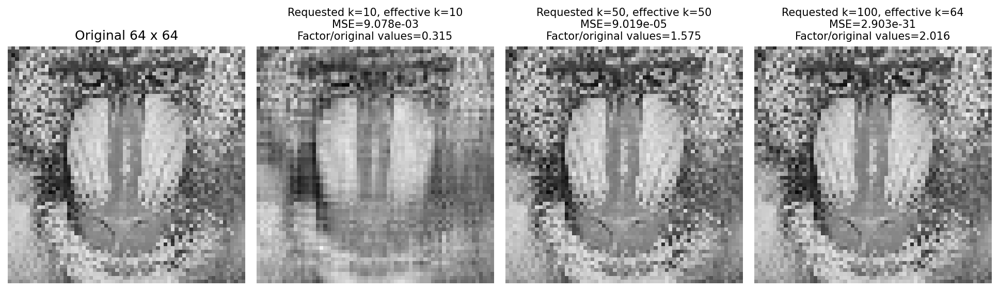

64×64 행렬의 SVD 성분은 최대 64개다. 요청 k=100도 그림에 포함하되 유효 k=64로 복원했다. k가 커지면 품질은 좋아지지만 저장 인자가 항상 줄지는 않는다. 같은 자료형으로 값 개수를 비교하면 k=10만 저장량이 감소한다. 별도 파일 포맷 압축률로 해석하지 않았다.

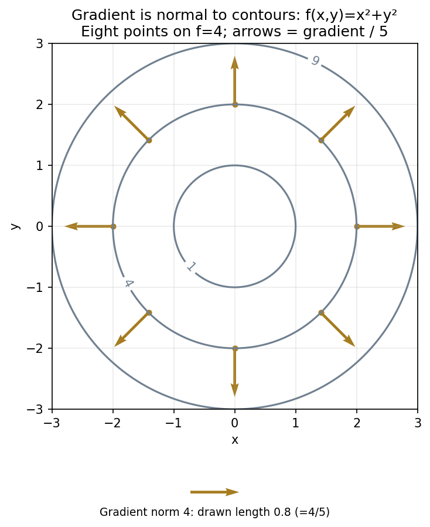

`∇f=(2x,2y)`는 원 중심에서 바깥 방향이고 접선 `(-y,x)`와 내적이 0이다. 수치 기울기 화살표가 등고선에 수직임을 확인했다.

## 7. 역전파 고정 예제의 결과

입력 `x=[1,0]`, `W1=[[.1,.2],[.3,.4]]`, `b1=[0,0]`, `W2=[.5,.6]`, `b2=0`, Sigmoid/BCE를 사용했다. PDF 본문의 `y_true`는 빈칸이고 7쪽 예시가 1이므로 **y_true=1**로 계산했다. 벡터는 `(2,)`, 첫 가중치 행렬은 `(2,2)`, 스칼라는 `()`다.

| 체크포인트 | shape | 손계산과 NumPy, 4자리 |
|---|---|---|
| z1 | (2,) | [.1000,.3000] |
| a1 | (2,) | [.5250,.5744] |
| z2 | () | .6072 |
| y_pred | () | .6473 |
| dL/dy_pred | () | -1.5449 |
| dL/dz2 | () | -.3527 |
| dL/dW2 | (2,) | [-.1852,-.2026] |
| dL/da1 | (2,) | [-.1764,-.2116] |
| dL/dz1 | (2,) | [-.0440,-.0517] |
| dL/dW1 | (2,2) | [[-.0440,0],[-.0517,0]] |

연쇄 법칙의 핵심은 `dL/dz2=y_pred-y_true`, `dL/dz1=(dL/da1)*a1*(1-a1)`, `dL/dW1=outer(dz1,x)`다. 전체 손계산·유도·실행 출력은 [역전파 노트북](notebooks/backprop_derivation.ipynb)에 있다. PDF 참고 값 `.6071`, `-.0513`은 주어진 입력을 반올림하지 않고 계산한 결과와 다르므로, 재계산한 `.6072`, `-.0517`을 기록했다.

## 8. 학습률과 Momentum의 결과

GD는 `θ←θ-lr*g`, Momentum은 `v←.9v+g`, `θ←θ-lr*v`를 사용했다. 경로 배열에는 초기점까지 포함하므로 100회 업데이트는 **101개 좌표**다. 독립 실험마다 옵티마이저를 새로 만들어 누적 상태가 섞이지 않게 했다.

| 함수·조건 | GD 최종 반경/손실 | Momentum 최종 반경/손실 | 손실 .01 첫 도달 GD/Momentum |
|---|---|---|---|
| 원형, lr=.1, 100회 | 1.4404×10⁻⁹ / 2.0748×10⁻¹⁸ | .020163 / .000406527 | 20회 / 10회 |
| 타원, lr=.01, 200회 | .087940 / .007733397 | 6.7892×10⁻⁵ / 4.5133×10⁻⁸ | 194회 / 78회 |

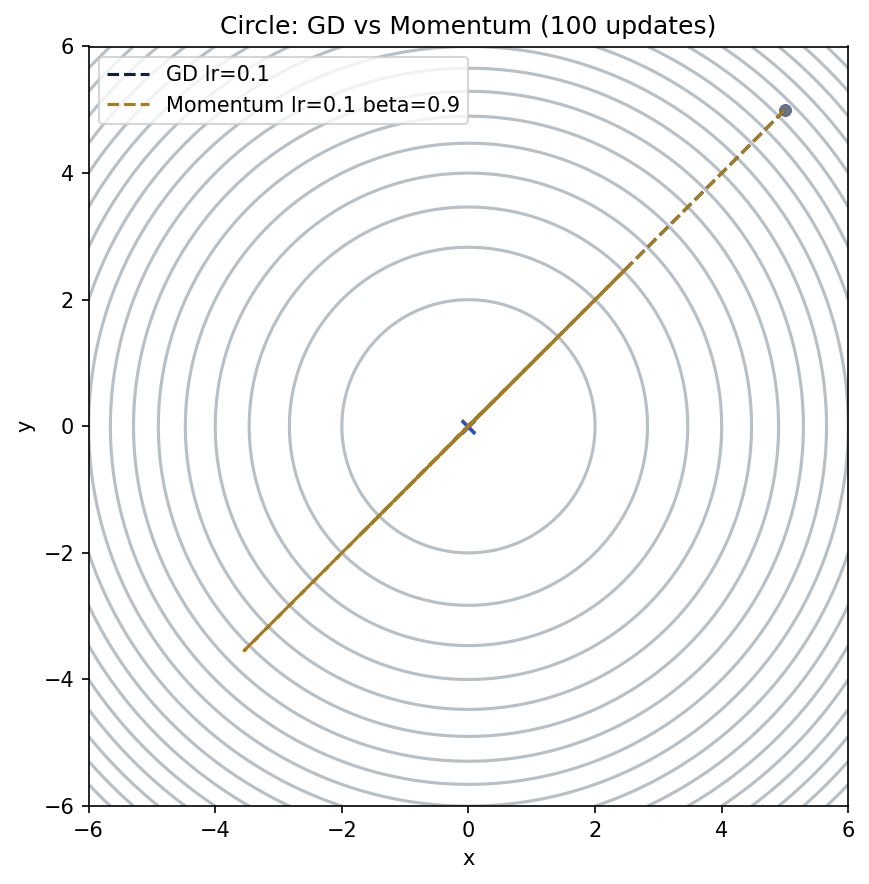
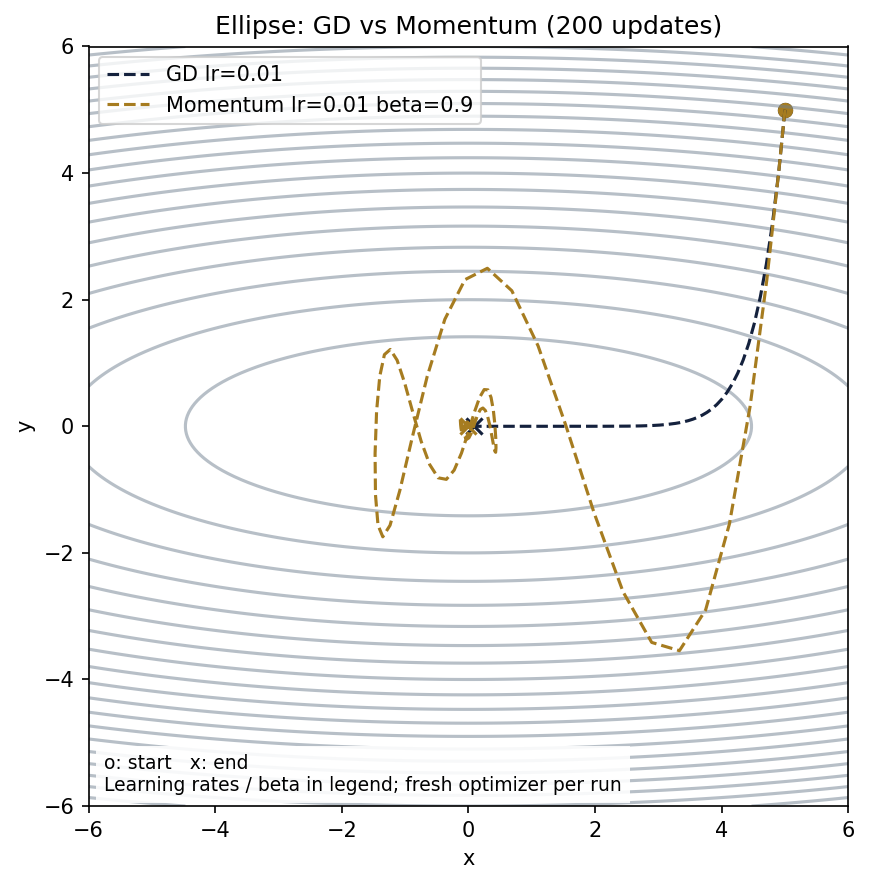
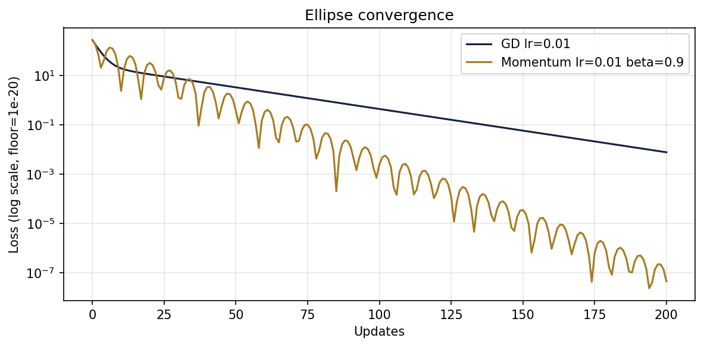

Momentum은 타원형 함수의 느린 축에서 기울기를 누적하여 같은 lr의 GD보다 기준에 빨리 도달했다. 관성으로 원점을 지나치며 진동하는 구간도 있다. 원형 함수의 100회 최종 오차는 GD가 더 작았다. ‘최초 도달’과 ‘계속 기준 이하 유지’는 다른 지표다.

원의 업데이트 식은 `θ_next=(1-2lr)θ`다. `0<lr<1`이면 수렴하고, `.5`에서는 한 번에 원점, `1`에서는 크기가 같은 진동, `1` 초과에서는 발산한다. PDF의 ‘lr≥.5 발산’은 모든 값을 일반화하면 맞지 않는다. 그 범위 중 실제 발산하는 **lr=1.1**을 제시하고 경계값도 함께 확인했다.

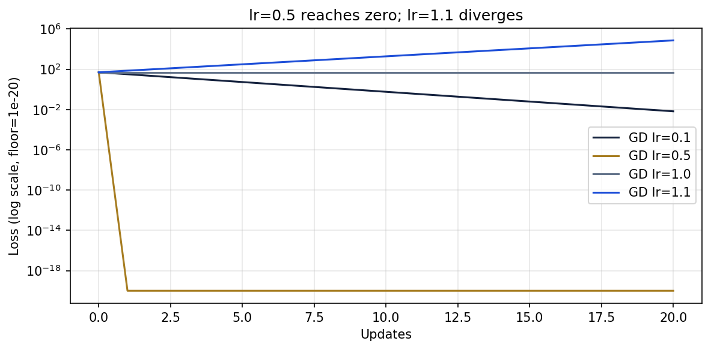

로그 그래프의 0 손실은 표시를 위해 1e-20으로만 제한했다. 저장된 수치 JSON에는 실제 0이 들어 있다. 점선 경로는 [learning_rate_paths.png](outputs/learning_rate_paths.png)에서 확인한다.

## 9. 확률 분포와 손실의 연결

`N(μ,σ²)` 규약에 따라 N(2,.5)의 **분산은 .5**다. 정규 PDF는 구간 아래 면적이 확률이고, 베르누이 PMF는 x=0/1의 막대 높이가 확률이다.

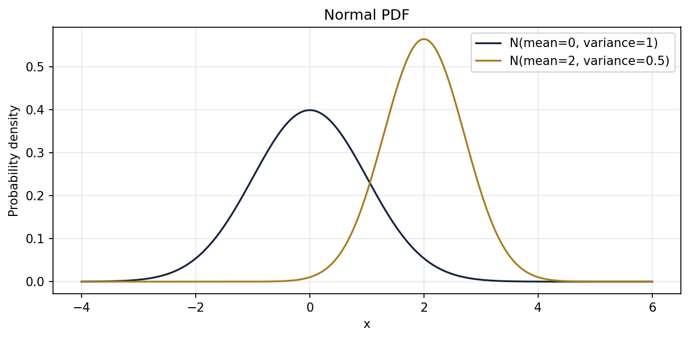
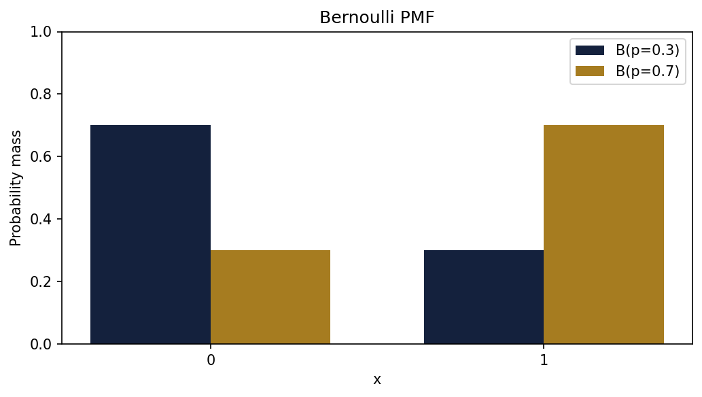

Softmax는 `exp(z-max(z))/sum(exp(z-max(z)))`로 직접 구현했다. 로짓 `[1000,1001,1002]`에서 확률은 `[.09003057,.24472847,.66524096]`, 합은 `.9999999999999999`로 오차가 1e-6 이하다.

독립 정규 잡음과 양의 고정 분산을 가정하면 다음 음의 로그우도가 나온다.

$$-\ln\mathcal L=\frac n2\ln(2\pi\sigma^2)+\frac1{2\sigma^2}\sum_i(y_i-f_\theta(x_i))^2$$

θ에 무관한 상수와 양의 배율을 제거하면 MSE 최소화와 같은 θ를 선택한다. 두 목적 함수의 숫자 자체가 같다는 뜻은 아니다.

$$\mathrm{BCE}=-\sum_i[y_i\ln q_i+(1-y_i)\ln(1-q_i)]$$
$$\mathrm{Categorical\ CE}=-\sum_i\sum_c y_{ic}\ln q_{ic}$$

두 식은 각각 Bernoulli·categorical likelihood의 음의 로그다. 독립성, 고정 분산, one-hot 정답 등의 가정과 전체 유도는 [확률·손실 노트북](notebooks/probability_loss.ipynb)에 있다.

## 10. 별도 보너스의 상속과 결과

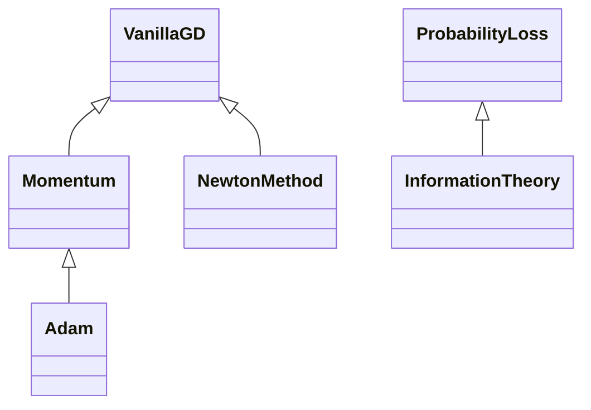

| 보너스 | 구현 | 실제 비교 결과 |
|---|---|---|
| Adam | [Adam(Momentum)](src/bonus_optimizer.py#L8), 1·2차 모멘트와 편향 보정 | 타원, 같은 lr=.01: GD/Momentum/Adam의 .01 첫 도달 194/78/1242회 |
| Newton | [NewtonMethod(VanillaGD)](src/bonus_optimizer.py#L33), `solve(H,g)` | 타원 Hessian diag(2,20), 1회에 원점 |
| 정보 이론 | [InformationTheory(ProbabilityLoss)](src/bonus_probability.py#L8) | p=[.3,.7], q=[.6,.4]: H=.610864, KL=.183787, CE=.794651 nats |

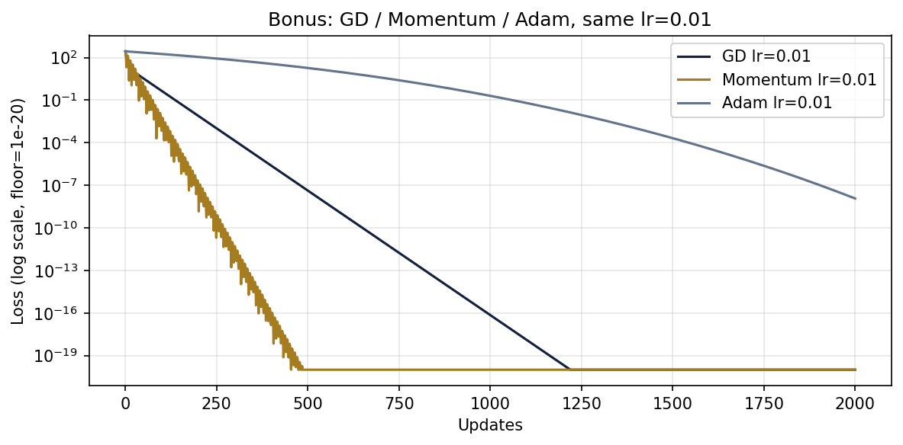

이 실험에서는 Adam이 가장 빠르지 않았다. 선택한 함수·초기점·lr에서의 결과이며 다른 함수의 보편적인 순위로 해석하지 않았다. Newton의 1회 도달도 Hessian이 일정한 이차 함수의 성질이다. 정보 이론은 자연로그 단위 nats, `0log0=0`, p>0/q=0이면 CE·KL 무한대라는 규약을 사용했다.

## 11. 결과 파일과 제출 전 확인

수치는 [metrics.json](reports/metrics.json)과 [bonus_metrics.json](reports/bonus_metrics.json), 실제 노트북 실행은 [notebook_execution.txt](reports/notebook_execution.txt)에 기록했다. 모든 함수·클래스의 Docstring을 검사했고, 자동 미분 라이브러리와 sklearn의 PCA·최적화 함수를 사용하지 않았다. [요구사항 재검토](docs/requirements_review.md)에 항목별 근거가 있다.

PDF는 결과가 포함된 GitHub Repository URL 제출을 요구한다. 여기서는 로컬 파일 작성과 실행 검증까지 수행했으며 원격 push·URL 제출 완료로 기록하지 않았다. 제출할 때는 실행된 필수 노트북, src, README, requirements, 입력과 출처, PNG가 저장소에 포함되어 있는지 확인한다.
