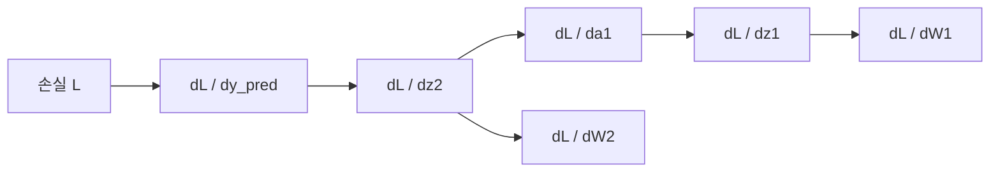
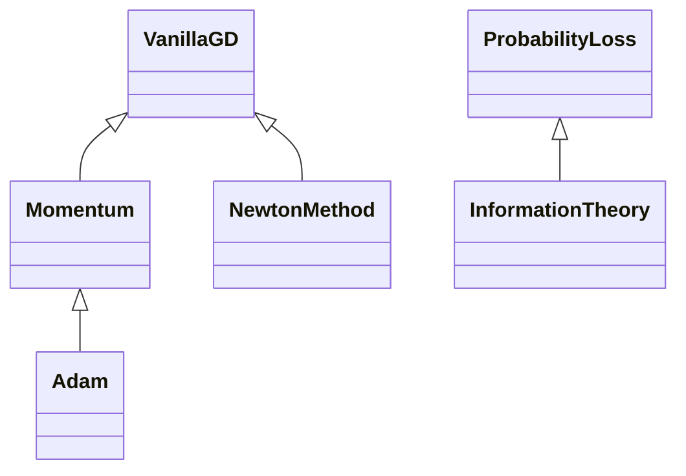

# A2-1 · 개념과 수식에서 실제 코드까지

이 문서는 처음 배우는 사람이 계산의 의미를 이해하고, 평가자가 실제 파일과 실행 결과를 따라갈 수 있도록 작성했다. 앞부분은 개념·현실적인 예·연관 코드·활용 상황을 연결하고, 뒷부분은 입력 준비부터 검증까지 코드 순서대로 설명한다. 숫자는 [실제 실행 결과](../reports/metrics.json)와 [보너스 결과](../reports/bonus_metrics.json)를 기준으로 적었다.

## 1. 먼저 이해한 개념과 수식

### 1.1 벡터, 행렬, shape — 여러 값을 정해진 순서로 다루기

벡터는 값의 목록, 행렬은 값의 표다. 두 입력을 가진 학생을 `[공부 시간, 이전 정답률]`로 표현하면 길이 2의 벡터가 된다. 행렬의 한 행은 여러 입력을 가중합해 결과 하나를 만드는 규칙으로 볼 수 있다.

$$z_1=W_1x+b_1$$

고정 예제에서는 `W1.shape=(2,2)`, `x.shape=(2,)`여서 결과 `z1.shape=(2,)`다. 첫 은닉 뉴런은 `.1*1+.2*0=.1`, 두 번째는 `.3*1+.4*0=.3`을 계산한다. 스칼라는 값 하나이며 NumPy shape은 `()`다.

- 현실적인 예: 제품의 가격·무게를 입력 두 개로 받고 점수 두 개를 계산하는 가중합.
- 연관 코드: [fixed_example/forward_backward](../src/backprop.py#L6), `W1 @ x + b1`.
- 활용 상황: 신경망의 층 계산, 행렬 곱의 차원 오류 확인. 실제 이 과제는 고정 값만 사용하며 학생·제품 모델을 학습하지 않는다.

### 1.2 회전·스케일링·전단 — 같은 좌표에 다른 규칙 적용

행렬을 곱하면 점이 이동한다. 회전은 방향을 바꾸고, 스케일링은 축별 길이를 바꾸며, 전단은 y좌표에 비례해 x좌표를 밀어낸다.

$$R(\theta): (x,y)\mapsto(x\cos\theta-y\sin\theta,\ x\sin\theta+y\cos\theta)$$
$$S(2,.5): (x,y)\mapsto(2x,.5y),\qquad Sh(k):(x,y)\mapsto(x+ky,y)$$

단위 원은 반지름 1인 원이다. 회전해도 원의 윤곽은 같으므로 첫 점으로 향하는 반지름선도 표시했다. 스케일링은 가로 2, 세로 .5의 반지름을 가진 타원으로 바뀐다.

- 현실적인 예: 지도나 사진을 돌리기, 가로로 늘리기, 기울여 붙이기.
- 연관 코드: [변환 행렬](../src/linear_algebra.py#L13), [transform_points](../src/linear_algebra.py#L29).
- 활용 상황: 컴퓨터 그래픽의 좌표 변환과 신경망 행렬 연산의 기하학적 해석.


### 1.3 행렬식과 면적 — 길이가 변해도 면적이 같을 수 있다

2×2 행렬 A의 행렬식은 `a*d-b*c`다. 부호는 방향 뒤집힘, 절댓값은 면적 변화율을 나타낸다. S(2,.5)는 가로 2배와 세로 .5배가 서로 상쇄되어 면적이 같다.

$$\frac{\mathrm{Area}(AP)}{\mathrm{Area}(P)}=|\det A|$$
$$\mathrm{Area}(P)=\frac12\left|\sum_i(x_i y_{i+1}-y_i x_{i+1})\right|$$

두 번째 식은 다각형의 신발끈 공식이다. 같은 단위 원 점 집합에 대해 변환 전후 면적을 따로 측정해 행렬식과 비교했다. 원을 100개 점으로 근사한 면적을 정확한 π와 섞어 비교하지 않았다.

- 현실적인 예: 종이를 가로로 두 배 늘리고 세로로 절반 줄이면 면적은 그대로다.
- 연관 코드: [polygon_area](../src/linear_algebra.py#L34), [면적 검증](../scripts/run_experiments.py#L54).
- 활용 상황: 선형 변환의 부피·면적 변화, 방향 반전 확인. 이 과제의 세 행렬은 모두 det=1이다.

### 1.4 고유벡터와 Power Iteration — 방향을 유지하는 벡터

고유벡터 v는 A를 곱해도 같은 직선 방향에 남는다. 배율 λ가 고유값이다. 양의 λ는 방향 유지, 음의 λ는 반대 방향을 뜻한다.

$$Av=\lambda v,\qquad v_{t+1}=\frac{Av_t}{\|Av_t\|},\qquad \lambda_t=v_t^TAv_t$$

반복해서 A를 곱하면 절댓값이 큰 고유값 방향의 성분이 상대적으로 커진다. 크기를 1로 정규화해 숫자가 너무 커지는 것을 막고, 마지막 식인 Rayleigh quotient로 배율을 계산했다. `||Av-λv||`가 1e-6 이하이면 종료했다.

- 현실적인 예: 여러 방향으로 늘어나는 고무판에서 가장 크게 늘어나는 방향을 찾기.
- 연관 코드: [power_iteration](../src/linear_algebra.py#L64).
- 활용 상황: 지배적인 고유 방향 추정. 초기 벡터에 해당 방향 성분이 있고 지배 고유값이 분리되어 있어야 잘 수렴한다. 실험은 `[[4,1],[1,3]]`에 한정했다. 일반 비대칭·복소 고유값까지 해결하는 알고리즘으로 설명하지 않는다.

### 1.5 SVD와 rank — 중요한 이미지 성분만 남기기

흑백 이미지는 픽셀 밝기를 담은 2차원 행렬이다. SVD는 이 행렬을 세 인자로 분해하고, 큰 특이값부터 k개를 남겨 근사한다.

$$A=U\Sigma V^T,\qquad A_k=U_k\Sigma_kV_k^T$$

성분 하나는 열 방향 패턴과 행 방향 패턴의 곱이다. 큰 성분은 전체적인 모양에, 작은 성분은 세부 변화에 기여할 수 있다. 이 설명은 특정 픽셀이나 객체와 성분이 일대일 대응한다는 뜻은 아니다.

- 현실적인 예: 그림을 모든 세부선 대신 주요 패턴 몇 개로 요약하기.
- 연관 코드: [svd_compress/svd_reconstruct](../src/linear_algebra.py#L85).
- 활용 상황: 저차 근사와 품질·저장량 비교. `np.linalg.svd`는 허용된 NumPy 분해를 사용했으며 SVD 알고리즘 자체를 직접 구현하라는 요구는 없다.

64×64 행렬은 최대 64개 성분을 가지므로 요청 k=100도 실제 k=64다. 저장할 수의 개수는 `k*(64+64+1)`이다. k=10은 1290개로 원본 4096개보다 적지만 k=50은 6450개다. 큰 k에서 품질이 좋아지는 것과 저장량이 줄어드는 것은 다르다.

### 1.6 미분과 중심차분 — 작은 입력 변화에 대한 출력 변화

미분은 한 점에서 함수가 얼마나 가파른지 나타낸다. 중심차분은 점의 좌우를 조금 움직여 기울기를 근사한다.

$$f'(x)\approx\frac{f(x+h)-f(x-h)}{2h},\qquad f(x)=x^2\Rightarrow f'(3)=6$$

`h=1e-5`로 계산했다. 중심차분은 매끄러운 함수에서 절단 오차가 보통 h² 규모지만, h를 무조건 작게 하면 비슷한 수를 빼는 부동소수점 오차가 커질 수 있다.

- 현실적인 예: 시간이 조금 변했을 때 이동 거리가 얼마나 변했는지로 순간 속도를 추정하기.
- 연관 코드: [central_difference](../src/calculus.py#L7).
- 활용 상황: 분석 미분 결과 확인, 역전파 gradient check.

### 1.7 Gradient와 등고선 — 가장 빨리 높아지는 방향

Gradient는 각 입력 축의 편미분을 모은 벡터다. 등고선은 함수값이 같은 점들의 집합이다.

$$f(x,y)=x^2+y^2,\qquad\nabla f=(2x,2y),\qquad(2x,2y)\cdot(-y,x)=0$$

`(-y,x)`는 원 등고선의 접선 방향이다. 내적 0은 수직이라는 뜻이다. 내려갈 때는 기울기의 반대 방향으로 이동한다.

- 현실적인 예: 지도 등고선을 가로질러 산을 오르는 가장 가파른 방향.
- 연관 코드: [numerical_gradient/plot_gradient](../src/calculus.py#L12), [circle_gradient](../src/optimizer.py#L42).
- 활용 상황: 다변수 최적화, 등고선에서 업데이트 경로 해석.


### 1.8 Sigmoid, BCE, 연쇄 법칙 — 예측의 오차를 입력 쪽으로 전달

Sigmoid는 실수 점수를 0과 1 사이로 바꾼다. BCE는 이진 정답의 예측 확률에 로그 벌점을 준다.

$$\sigma(z)=\frac1{1+e^{-z}},\qquad\sigma'(z)=\sigma(z)(1-\sigma(z))$$
$$L=-[y\ln\hat y+(1-y)\ln(1-\hat y)]$$
$$\frac{\partial L}{\partial z_2}=\frac{\partial L}{\partial\hat y}\frac{\partial\hat y}{\partial z_2}=\hat y-y$$

정답이 1이면 BCE는 `-ln(y_pred)`다. 확률 .9의 손실은 약 .1054, .1의 손실은 약 2.3026이므로 틀린 쪽으로 확신할수록 벌점이 크다. 연쇄 법칙은 중간 단계를 거친 변화율을 곱한다. 역전파는 이 곱을 출력에서 입력 방향으로 정리한 계산이다.

- 현실적인 예: 최종 합격 확률이 바뀌었을 때 각 입력 가중치가 얼마나 영향을 주었는지 계산하기.
- 연관 코드: [sigmoid/forward_backward](../src/backprop.py#L12), [전체 유도 노트북](../notebooks/backprop_derivation.ipynb).
- 활용 상황: 수동 기울기 계산과 신경망의 학습 원리 이해. 자동 미분을 호출하지 않았다.

### 1.9 GD와 Momentum — 이동 거리와 이전 방향의 기억

GD는 기울기 g의 반대 방향으로 학습률 η만큼 이동한다. Momentum은 이전 기울기를 감쇠하며 누적한다.

$$\theta_{t+1}=\theta_t-\eta g_t$$
$$v_t=\beta v_{t-1}+g_t,\qquad\theta_{t+1}=\theta_t-\eta v_t$$

이 Momentum 규약에는 `(1-beta)`가 현재 기울기 앞에 없다. 규약이 다른 코드를 비교할 때 같은 lr의 의미가 달라질 수 있으므로 식을 명시했다. β=.9, 초기 v=0이다.

- 현실적인 예: 경사면을 내려가는 공은 이전 방향의 속도를 유지해 낮은 곳을 지나칠 수 있다.
- 연관 코드: [VanillaGD/Momentum](../src/optimizer.py#L7).
- 활용 상황: 타원형 손실의 느린 축에서 이동 가속, overshoot와 진동 해석.

원형 함수는 `θ_next=(1-2lr)θ`라서 .5에서 한 번에 원점에 도달한다. 1.1이면 배율 -1.2로 방향은 번갈아 바뀌고 크기는 증가한다. 타원형 함수의 GD는 축 배율 `1-2lr`, `1-20lr`를 가지며 수렴 범위는 `0<lr<.1`이다.

### 1.10 확률밀도 PDF와 확률질량 PMF — 연속 값과 이산 값

확률밀도함수 PDF는 연속 변수의 구간 확률을 면적으로 나타낸다. 점 하나의 밀도 높이를 확률로 읽지 않는다. 확률질량함수 PMF는 이산 값 자체의 확률이다. 여기의 PDF 약어는 과제 문서 파일 형식과 다른 뜻이다.

$$p(x)=\frac1{\sqrt{2\pi\sigma^2}}\exp\left[-\frac{(x-\mu)^2}{2\sigma^2}\right]$$
$$P(Y=y)=p^y(1-p)^{1-y},\qquad y\in\{0,1\}$$

- 현실적인 예: 연속적인 측정 오차는 정규분포, 한 번의 성공/실패는 베르누이분포.
- 연관 코드: [ProbabilityLoss.normal_pdf/bernoulli_pmf](../src/probability.py#L7).
- 활용 상황: 회귀·이진 분류의 관측 모델. N(μ,σ²)를 쓰므로 N(2,.5)의 표준편차는 √.5다.

### 1.11 Softmax — 여러 점수를 합 1의 확률로 바꾸기

지수는 모든 점수를 양수로 바꾸고 합으로 나누면 전체 확률 합이 1이 된다. 가장 큰 로짓 m을 먼저 빼도 공통 배율이 약분되어 같은 결과다.

$$q_j=\frac{e^{z_j-m}}{\sum_k e^{z_k-m}},\qquad m=\max_k z_k$$

- 현실적인 예: 사과·배·복숭아의 분류 점수 세 개를 선택 확률로 바꾸기.
- 연관 코드: [softmax](../src/probability.py#L24).
- 활용 상황: 다중 클래스 분류 확률, 큰 양수 로짓의 overflow 방지. 이 구현의 입력 범위는 1차원 벡터다.

### 1.12 Likelihood, MLE, MSE, Cross-Entropy — 왜 이런 손실을 사용하는가

확률은 파라미터가 정해졌을 때 결과를 바라보고, 우도(likelihood)는 관측 결과를 고정한 채 파라미터를 바꿔 바라본다. MLE는 관측 결과를 가장 그럴듯하게 만드는 파라미터를 고른다. 독립 관측은 확률을 곱하고 로그를 취하면 합이 된다.

$$\mathcal L(\theta)=\prod_i p(y_i|x_i,\theta)$$
$$-\ln\mathcal L(\theta)=\frac n2\ln(2\pi\sigma^2)+\frac1{2\sigma^2}\sum_i(y_i-f_\theta(x_i))^2$$

정규 잡음, 독립 관측, 양의 고정 분산을 가정하면 첫 항은 상수다. 남은 항은 제곱 오차의 양의 배율이므로 MSE와 같은 최소점을 가진다. 독립 Bernoulli의 음의 로그우도는 BCE, 독립 categorical의 음의 로그우도는 `-Σ_iΣ_c y_ic ln(q_ic)`다.

- 현실적인 예: 센서 잡음이 정규분포인 온도 회귀와 성공/실패 분류에서 서로 다른 관측 모델에 맞는 손실을 선택하기.
- 연관 코드: [probability_loss.ipynb](../notebooks/probability_loss.ipynb)의 MLE 유도와 NumPy 확인.
- 활용 상황: MSE와 CE를 선택하는 수학적 근거. 목적 함수의 값이 같다는 말이 아니라 최소화하는 파라미터가 같다는 의미다.

### 1.13 보너스 Adam과 Newton — 좌표별 크기와 곡률을 사용

Adam은 기울기의 평균 방향과 제곱 크기를 누적한다. 0으로 초기화한 누적값의 편향을 보정하고 좌표별로 나눈다.

$$m_t=\beta_1m_{t-1}+(1-\beta_1)g_t,\quad v_t=\beta_2v_{t-1}+(1-\beta_2)g_t^2$$
$$\hat m_t=\frac{m_t}{1-\beta_1^t},\quad\hat v_t=\frac{v_t}{1-\beta_2^t},\quad\theta_{t+1}=\theta_t-\eta\frac{\hat m_t}{\sqrt{\hat v_t}+\epsilon}$$

Newton은 2차 미분을 모은 Hessian H로 굽은 정도를 고려한다.

$$\theta_{t+1}=\theta_t-H^{-1}g_t$$

- 현실적인 예: Adam은 좌표마다 다른 이동 척도를 쓰는 방법, Newton은 길의 기울기와 굽은 정도를 함께 보고 이동 거리를 정하는 방법으로 생각할 수 있다.
- 연관 코드: [Adam](../src/bonus_optimizer.py#L8), [NewtonMethod](../src/bonus_optimizer.py#L33).
- 활용 상황: 적응적인 업데이트 및 이차 함수 최적화. 일반 함수의 Newton은 Hessian 비용과 특이/부정정 행렬 문제가 있다. 이 과제는 해석적인 diag(2,20)을 사용했다.

### 1.14 보너스 엔트로피·KL·Cross-Entropy — 불확실성과 잘못된 예측의 추가 비용

엔트로피는 실제 분포 p의 평균적인 정보량이다. KL은 p의 관측을 q로 예측할 때 생기는 추가 로그 손실이다. Cross-Entropy는 전체 평균 로그 손실이다.

$$H(p)=-\sum_jp_j\ln p_j,\quad D_{KL}(p\Vert q)=\sum_jp_j\ln\frac{p_j}{q_j}$$
$$H(p,q)=-\sum_jp_j\ln q_j=H(p)+D_{KL}(p\Vert q)$$

- 현실적인 예: 공정한 동전은 결과가 불확실하고, 항상 앞면인 동전은 불확실성이 없다. 실제 앞면 확률 .3을 .6으로 예측하면 추가 비용이 발생한다.
- 연관 코드: [InformationTheory](../src/bonus_probability.py#L8).
- 활용 상황: 예측 분포와 실제 분포의 차이 해석. KL은 비대칭이고 일반적인 거리가 아니다. 자연로그 단위는 nats, `0log0=0`, p>0인데 q=0이면 손실은 무한대다.

## 2. 실제 코드를 순서대로 설명

### 2.1 요구사항을 검증할 테스트부터 정리

[test_core.py](../tests/test_core.py)는 PDF의 오차 기준과 고정 입력을 코드로 고정한다. 면적 1%, eig 비교 5%, 중심차분 1e-4, 반경 .1, Softmax 1e-6을 각각 검사했다. 행렬 곱의 shape, SVD 성분 상한, 역전파 손계산의 4자리도 확인했다.


평가할 때는 [core Red](../reports/tdd_core_red.txt)의 `ModuleNotFoundError`와 [전체 Green](../reports/tdd_all_green.txt)의 27개 통과를 먼저 확인할 수 있다. [bonus Red](../reports/tdd_bonus_red.txt)는 확률 합 허용오차 테스트의 실제 실패다. 보너스 첫 실행은 구현 후에 완료되어 통과했기 때문에 그 로그를 실패 증거로 적지 않았다. 정확한 순서는 [재검토 8절](requirements_review.md#8-tdd-기록과-작업-범위)에 설명했다.

### 2.2 공개 이미지 입력 준비

[prepare_image.py](../scripts/prepare_image.py#L12)에서 P2 파일을 읽는다. `#` 뒤의 주석을 제거하고 헤더의 width/height/maximum을 읽었다. 이후 픽셀을 `(height,width)`로 reshape하고 최대 회색값으로 나눈다.

```python
pixels = np.array(tokens[4:], dtype=float).reshape(height, width)
image = original[::8, ::8]
```

원본 512×512에서 8칸 간격으로 선택하면 64×64가 된다. 별도 보간을 하지 않았으므로 질감 일부가 빠질 수 있다. [SOURCE.md](../data/SOURCE.md)에 출처와 라이선스 안내, [메타데이터](../data/source_metadata.json)에 SHA-256과 크기를 남겼다. 결과 재실행에는 네트워크가 필요 없다.

### 2.3 단위 원의 변환과 면적 측정

[unit_circle](../src/linear_algebra.py#L7)은 cos/sin 좌표를 열로 합쳐 `(100,2)` 배열을 만든다. [transform_points](../src/linear_algebra.py#L29)는 점을 행으로 저장했으므로 `points @ matrix.T`를 사용한다. 이것은 점 하나를 열벡터로 쓴 `A @ p`와 같은 결과다.

```python
return np.asarray(points) @ np.asarray(matrix).T
```

[polygon_area](../src/linear_algebra.py#L34)는 `np.roll`로 다음 꼭짓점을 연결하고 신발끈 공식을 계산한다. [plot_transformations](../src/linear_algebra.py#L40)는 세 축 각각에 원본 점선과 변환 실선을 겹쳐 표시했다. S(2,.5)의 det와 면적비는 모두 1, 오차는 0%다.

### 2.4 Power Iteration에서 eig를 계산에 사용하지 않기

[power_iteration](../src/linear_algebra.py#L64)의 초기 벡터는 모든 값이 1인 벡터를 정규화한 것이다. 반복에서 행렬 곱과 norm만 사용한다.

```python
product = matrix @ vector
vector = product / np.linalg.norm(product)
value = float(vector @ matrix @ vector)
```

이후 잔차 `||A@v-value*v||`가 허용오차 이하면 반환한다. [실험 실행기](../scripts/run_experiments.py#L75)와 [검증 테스트](../tests/test_core.py#L50)에서만 `np.linalg.eig`를 호출해 비교했다. 20회 뒤 λ≈4.61803399, 상대 오차≈8.50×10⁻¹²%다. PDF의 참고 반복 횟수 51회와 같을 필요는 없다. 초기값과 종료 기준이 달라질 수 있기 때문이다.

### 2.5 SVD의 인자와 복원

[svd_compress](../src/linear_algebra.py#L85)는 `full_matrices=False`로 분해하고 큰 특이값부터 슬라이스한다. 유효 성분 수는 요청 k와 특이값 개수 중 작은 값이다.

```python
effective_k = min(k, len(singular_values))
return u[:, :effective_k], singular_values[:effective_k], vt[:effective_k, :]
```

[svd_reconstruct](../src/linear_algebra.py#L94)의 `(u * singular_values) @ vt`는 U의 각 열에 해당 특이값을 곱한다. 별도 대각 행렬을 만드는 것과 같은 계산이다. `U_k:(64,k)`, `s_k:(k,)`, `Vt_k:(k,64)`가 `(64,64)`로 복원된다.


MSE는 k=10에서 .009078436, 50에서 .000090186, 요청 100/실제64에서 2.90×10⁻³¹이다. k=100의 요청을 빼거나 이미지를 100×100으로 늘리지 않았다.

### 2.6 중심차분과 Gradient 화살표

[central_difference](../src/calculus.py#L7)는 좌우 평가값의 차이를 2h로 나눈다. x²의 x=3에서 오차 3.93×10⁻¹¹로 PDF 기준보다 작았다.

[numerical_gradient](../src/calculus.py#L12)는 좌표 하나씩 ±h 움직인 배열을 만들어 편미분을 계산한다. [plot_gradient](../src/calculus.py#L24)는 `meshgrid`로 등고선을 만들고 반경 2의 여덟 점에서 기울기를 계산해 `quiver` 화살표를 그린다. 표시를 위한 화살표 scale은 계산한 기울기 자체를 바꾸지 않는다.

### 2.7 신경망의 순전파에서 shape 확인

[backprop.py](../src/backprop.py#L17)는 값을 `values`, 미분을 `gradients` 딕셔너리로 반환한다. 순전파는 고정 예제의 네 중간값을 명시적으로 저장한다.


| 순서 | 계산 | shape | 4자리 |
|---|---|---|---|
| 1 | z1=W1@x+b1 | (2,) | [.1000,.3000] |
| 2 | a1=sigmoid(z1) | (2,) | [.5250,.5744] |
| 3 | z2=W2@a1+b2 | () | .6072 |
| 4 | y_pred=sigmoid(z2) | () | .6473 |
| 5 | L=BCE(y=1,y_pred) | () | .4350 |

입력과 가중치 shape 및 손계산 전개는 [역전파 노트북](../notebooks/backprop_derivation.ipynb)에 있다. PDF 3쪽 y_true 빈칸은 7쪽의 1로 해석했다. 표를 표시하기 전에는 반올림하지 않았다.

### 2.8 여섯 미분을 역방향으로 연결



역전파 도식의 화살표는 미분 계산에 앞 단계 값이 필요한 순서다. 순전파 신경망의 데이터 흐름과는 반대 방향의 계산 순서로 읽는다.

| 미분 | 코드의 수식 | shape | 4자리 결과 |
|---|---|---|---|
| dy_pred | -y/y_pred+(1-y)/(1-y_pred) | () | -1.5449 |
| dz2 | dy_pred*y_pred*(1-y_pred) = y_pred-y | () | -.3527 |
| dW2 | dz2*a1 | (2,) | [-.1852,-.2026] |
| da1 | dz2*W2 | (2,) | [-.1764,-.2116] |
| dz1 | da1*a1*(1-a1) | (2,) | [-.0440,-.0517] |
| dW1 | np.outer(dz1,x) | (2,2) | [[-.0440,0],[-.0517,0]] |

W1의 두 번째 열이 0인 이유는 두 번째 입력 x[1]=0이기 때문이다. 편향은 `db1=dz1`, `db2=dz2`다. 코드의 BCE는 이 작은 고정 예제의 유도용이며 극단적인 로짓까지 처리하는 범용 학습 라이브러리로 확장하지 않았다.

평가 근거는 두 가지다. 첫째, 노트북에서 독립 손계산 값을 소수점 4자리까지 대조했다. 둘째, [모든 파라미터 gradient check](../tests/test_core.py#L112)에서 손실 중심차분과 절대 오차 1e-8 이내인지 확인했다. PDF의 `dz1[1]=-.0513` 대신 원래 값으로 계산한 `-.0517`을 사용했다.

### 2.9 옵티마이저의 인터페이스와 경로 배열

[VanillaGD.step](../src/optimizer.py#L14)은 좌표와 기울기를 받아 새 좌표를 반환한다. [Momentum.step](../src/optimizer.py#L28)은 같은 인터페이스에 velocity 상태를 추가했다. [optimize](../src/optimizer.py#L58)는 알고리즘별 분기 없이 `optimizer.step`을 반복한다.

```python
point = optimizer.step(point, gradient_function(point))
history.append(point.copy())
```

초기점도 history에 저장하므로 100회 뒤 shape은 `(101,2)`다. `.copy()`는 과거 좌표 기록을 독립된 배열로 남긴다. 누적 상태는 실험마다 새 인스턴스를 만들어 초기화한다.

원형 함수는 GD lr=.1, 100회 뒤 반경 1.4404×10⁻⁹로 통과했다. lr=.5/1/1.1은 각각 한 번에 도달/진동/발산했다. [loss 그래프](../outputs/learning_rate_loss.png)는 잘못된 임계값 설명을 확인하는 근거다.

### 2.10 Momentum 비교는 함수·학습률·측정 기준과 함께 읽기

[plot_paths](../src/optimizer.py#L71)는 같은 등고선 위에 두 경로를 점선으로 그린다. [plot_loss_curves](../src/optimizer.py#L89)는 반복 수 대비 실제 손실을 로그 축으로 비교한다. 0을 로그로 표시할 수 없어 그래프에서만 1e-20으로 제한했다.


타원형 함수, 초기점 (5,5), 같은 lr=.01에서 손실 .01에 처음 도달한 업데이트 수는 GD 194회, Momentum 78회다. Momentum은 느린 x축 방향으로 기울기를 누적하지만 y축에서 원점을 지나치는 진동도 보인다. 최초 도달 뒤 다시 손실이 증가할 수 있다.

원형 함수에서는 최초 도달 Momentum 10회/GD 20회였으나 100회 최종 손실은 GD가 더 작았다. 같은 알고리즘도 평가 시점과 기준에 따라 비교 결과가 달라진다는 사실을 함께 기록했다.

### 2.11 분포 그림과 안정적인 Softmax

[probability.py](../src/probability.py)는 필수 확률 계산을 `ProbabilityLoss`에 모았다. 보너스 상속을 위해 기본 클래스를 사용했으며 복잡한 학습 체계를 만들지 않았다.

정규 PDF는 평균 0/2와 분산 1/.5를 사용한다. 베르누이 PMF는 x=[0,1]에서 p=.3/.7의 막대를 나란히 표시한다. [확률 노트북](../notebooks/probability_loss.ipynb)은 각 분포의 의미와 PDF 적분≈1, PMF 합=1도 확인한다.

```python
shifted = np.asarray(logits, dtype=float) - np.max(logits)
exponentials = np.exp(shifted)
return exponentials / np.sum(exponentials)
```

로짓 [1000,1001,1002]는 [.09003057,.24472847,.66524096]이 되고 합 오차≈1.11×10⁻¹⁶이다. `exp(1000)`을 직접 계산하지 않았다. [테스트](../tests/test_core.py#L183)는 큰 값의 안정성과 상수 이동 불변성도 확인한다.

### 2.12 MLE 유도는 노트북에서 단계별로 확인

[probability_loss.ipynb](../notebooks/probability_loss.ipynb)의 4절은 독립 정규 관측의 likelihood→로그합→음의 로그→상수 제거 순서로 MSE를 유도한다. 고정 분산 가정을 명시했다. NumPy 예시에서도 MSE와 정규 NLL의 최소점 인덱스가 같다.

5절은 Bernoulli의 `q^y(1-q)^(1-y)`에서 BCE를 유도하고, 6절은 categorical의 `Π_c q_c^y_c`에서 one-hot CE를 유도한다. BCE 고정 예제 손실 .4349584369와 categorical 예시의 정답 확률 로그도 확인했다.

### 2.13 보너스는 기존 클래스를 상속한 별도 파일



`Adam(Momentum)`은 기본 lr·beta·velocity를 상속하고 2차 모멘트·t·epsilon을 추가했다. 기본 Momentum과 달리 Adam의 평균 모멘트에는 `(1-beta)`가 붙는다. [두 번 업데이트 테스트](../tests/test_bonus.py#L24)로 편향 보정까지 확인했다.

`NewtonMethod(VanillaGD)`는 같은 step 인터페이스를 사용하고 저장한 Hessian 함수에서 H를 구한다. `np.linalg.solve(H,gradient)`로 이동량을 계산한다. 함수 x²+10y²는 H=diag(2,20)이어서 한 번에 원점에 도달한다.

`InformationTheory(ProbabilityLoss)`는 기본 Softmax 등을 상속한다. 엔트로피·KL·CE 계산은 별도 보너스 파일에서 직접 구현했다. 0 확률 항을 제외하고, p>0/q=0인 경우 무한대를 반환한다. 확률 벡터의 합 검사에는 상대 허용오차를 쓰지 않고 절대 허용오차 1e-10을 사용했다.

보너스 실험은 [bonus_report.ipynb](../notebooks/bonus_report.ipynb)에 분리했다. 같은 lr=.01의 타원 함수에서 GD/Momentum/Adam의 손실 .01 최초 도달은 194/78/1242회다. Adam이 가장 빠르다고 결론 내리지 않았다. [정보 이론 결과](../reports/bonus_metrics.json)는 `.7946511994=.6108643021+.1837868974` nats로 CE=H+KL을 확인한다.

### 2.14 재현 실행과 마지막 범위 검토

[run_experiments.py](../scripts/run_experiments.py#L54)는 seed를 고정하고 필수 PNG/metrics를 저장한다. `--bonus`일 때만 별도 보너스 모듈을 불러온다. [run_notebooks.py](../scripts/run_notebooks.py#L22)는 현재 Python 실행 파일을 쓰는 로컬 커널로 노트북을 실행한다. 출력과 커널 경로는 [실행 기록](../reports/notebook_execution.txt)에 남겼다.

[README](../README.md#4-py312에서-실행)의 명령으로 테스트·실험·노트북·HTML을 재생성한다. [요구사항 재검토](requirements_review.md)는 PDF를 다시 읽고 필수 기능, 허용 라이브러리, 금지 라이브러리, 보너스 상속, 예시 수치의 차이를 대조한 결과다. 자동 미분, sklearn PCA/최적화, 추가 학습 서비스는 구현하지 않았다.

## 3. 평가자가 확인할 근거

| 평가 관점 | 확인할 코드·파일 | 확인 내용 |
|---|---|---|
| 요구사항 준수 | [재검토](requirements_review.md) | PDF 각 항목과 구현·증거의 대응 |
| TDD | [테스트](../tests/test_core.py), [실행 기록](../reports/tdd_all_green.txt) | 독립 기준, 실제 Red/Green, 27개 통과 |
| 선형대수 | [모듈](../src/linear_algebra.py), [수치](../reports/metrics.json) | 면적비/eig 검증/SVD 상한 |
| 미적분 | [모듈](../src/calculus.py), [기울기 PNG](../outputs/gradient_contours.png) | 중심차분과 수직 방향 |
| 역전파 | [노트북](../notebooks/backprop_derivation.ipynb), [코드](../src/backprop.py) | 고정 숫자, shape, 여섯 미분, 수치 미분 |
| 최적화 | [모듈](../src/optimizer.py), [타원 손실](../outputs/ellipse_loss.png) | 업데이트 규약과 조건을 포함한 비교 |
| 확률·손실 | [노트북](../notebooks/probability_loss.ipynb), [코드](../src/probability.py) | 분포·Softmax·MLE 가정과 유도 |
| 보너스 분리 | [옵티마이저](../src/bonus_optimizer.py), [정보 이론](../src/bonus_probability.py) | 실제 상속과 독립 결과 |
| 재현성 | [requirements](../requirements.txt), [출처](../data/SOURCE.md) | py312 버전, seed42, 공개 입력과 SHA-256 |

HTML의 도식은 Markdown Mermaid의 노드와 관계를 유지해 SVG로 다시 그렸다. 수식은 외부 렌더러 없이 MathML로 표시하고 실제 PNG도 파일에 포함했다. 이 문서는 과제 코드의 검증 범위를 설명하며 원격 저장소 제출 완료를 의미하지 않는다.
