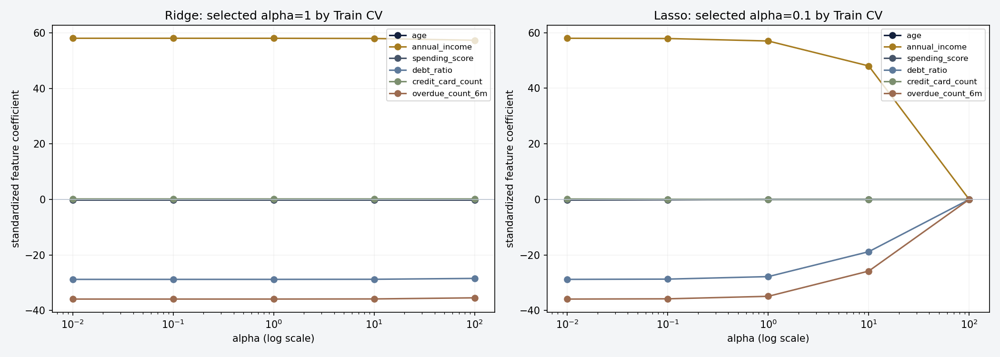
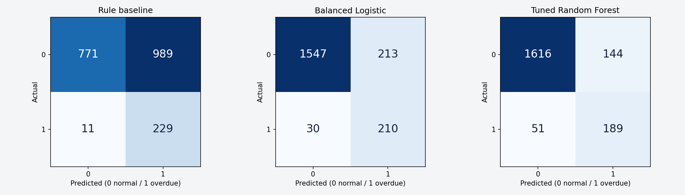
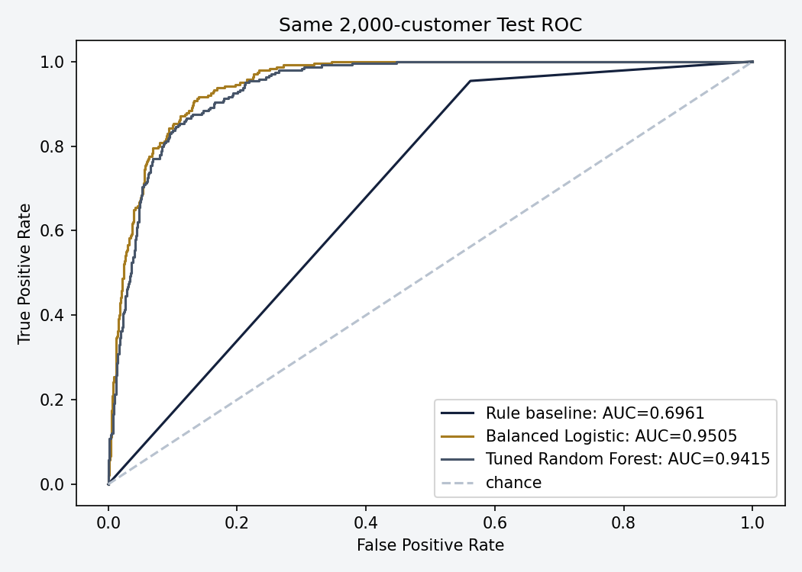
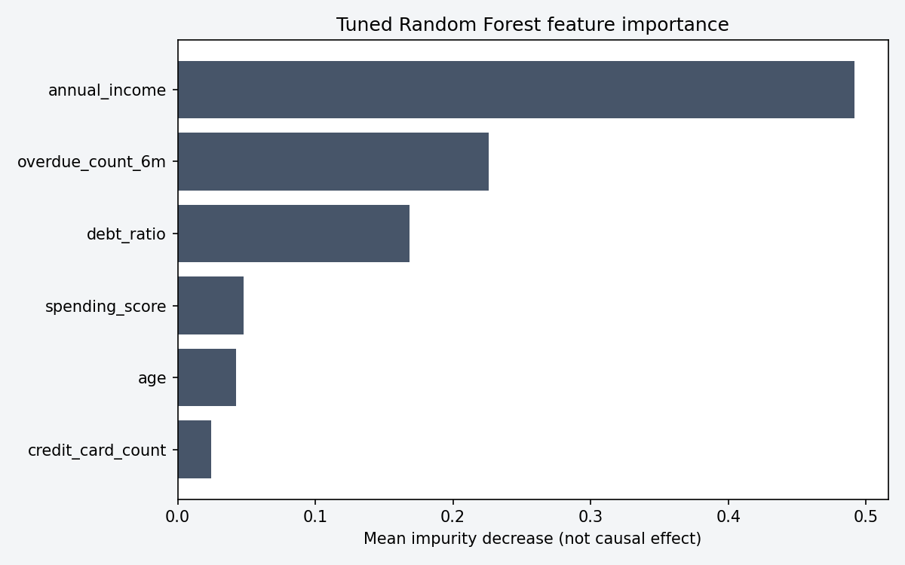
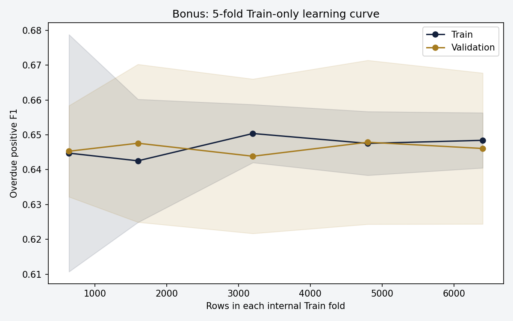

# A5-1: 초보 개념에서 실제 코드 평가까지

지도학습을 처음 배우는 독자는 01~05에서 입력·정답·데이터 분리·전처리를 이해한 뒤 06~11에서 수식과 모델·실측 평가를 읽고 12~15에서 실행·보너스·TDD를 확인합니다. 현실 예시의 교육용 손계산과 실제 10,000행 측정 결과를 구분합니다. 함수 링크는 실제 코드의 해당 줄로 연결되고 HTML에는 전체 원문도 내장됩니다.

## 먼저 알아둘 기본 용어

한 행은 고객 한 명입니다. feature는 예측 입력 열, target은 학습 정답, fit은 통계·계수 학습, transform은 배운 통계로 변환, predict는 새 입력의 답 계산입니다. NumPy array는 숫자 배열, Pandas DataFrame은 행·열 이름을 가진 표, sklearn Pipeline은 처리를 순서대로 연결한 객체입니다. [6개 입력] → [학습한 변환] → [모델] → [예측]을 같은 관점으로 읽습니다.

## 01. 지도학습: 고객 입력과 두 종류의 정답

### 개념과 필요한 이유

지도학습은 입력 X와 이미 알고 있는 정답 y를 짝지어 관계를 학습하는 방법입니다. 한 행은 한 고객이고 열은 고객의 특징입니다. 이번 입력은 나이, 연소득, 소비 점수, 부채비율, 카드 수, 최근 6개월 연체 횟수의 정확히 6개입니다. credit_score는 연속 숫자를 맞히는 회귀 정답, is_overdue는 0/1을 맞히는 분류 정답입니다. 학습 때 정답을 보되, 새로운 고객을 예측할 때는 이 두 정답을 입력으로 주지 않습니다. 같은 X로 학습하더라도 서로 다른 y에는 모델과 지표가 달라집니다.

### 현실 예시: 입력→계산→판단

1단계: 연소득 5,000만원, 연체 1회, 부채비율 0.4인 가상 고객을 생각합니다. 2단계: 노이즈가 없다면 생성식의 신용점수는 300 + (5000/100)×3 − 1×50 − 0.4×100 = 360점입니다. 3단계: 난수 노이즈가 +20점이면 최종 점수는 380점으로 반올림·범위 제한됩니다. 4단계: 이 점수의 하위 15% 여부와 별도 난수로 연체 레이블을 만듭니다. 점수가 낮다는 이유만으로 모든 고객을 1로 만들지 않습니다. 이 손계산은 생성식을 이해하는 교육용 예이고 실제 고객 한 명의 보고서 값과 구분합니다.

$$ credit_score=clip(300+0.03×income−50×overdue−100×debt+noise,0,1000) $$

<!-- diagram:supervised -->

처리순서: 6개 고객 입력 → 두 정답 생성 → 회귀와 분류로 분리

### 실제 코드와 순차 실행

generate_data는 seed 42 설정 → 6개 입력 생성 → 소득 하한 1500 적용 → 점수 노이즈·clip·반올림 → 하위 15% 점수 경계 → 연체 레이블 → shuffle 순서입니다. PDF 주석은 음수 처리라고 쓰였지만 실제 식은 max(x,1500)이므로 이를 유지했습니다. 임의 이상값 제거나 외부 데이터 합치기를 하지 않습니다. 결과는 10,000×8이며 입력 6열과 정답 2열입니다.

[실제 코드: data_gen.py · generate_data · L9](../data_gen.py#L9)

```python
def generate_data(path=None):
    """외부 데이터·추가 정제 없이 PDF 데이터 생성 결과를 반환/저장한다."""
    np.random.seed(RANDOM_STATE)
    data = {
        "age": np.random.randint(20, 70, N_SAMPLES),
        "annual_income": np.random.normal(5000, 2000, N_SAMPLES).round(0),
        "spending_score": np.random.randint(1, 100, N_SAMPLES),
        "debt_ratio": np.random.uniform(0, 1, N_SAMPLES).round(2),
        "credit_card_count": np.random.randint(1, 10, N_SAMPLES),
        "overdue_count_6m": np.random.poisson(0.5, N_SAMPLES),
    }
    df = pd.DataFrame(data)
    df["annual_income"] = df["annual_income"].apply(lambda x: max(x, 1500))
    df["credit_score"] = (
        300 + (df["annual_income"] / 100) * 3
        - df["overdue_count_6m"] * 50 - df["debt_ratio"] * 100
        + np.random.normal(0, 30, N_SAMPLES)
    )
    df["credit_score"] = df["credit_score"].clip(0, 1000).round(0)
    threshold = df["credit_score"].quantile(0.15)
    df["is_overdue"] = np.where(
        (df["credit_score"] < threshold) & (np.random.rand(N_SAMPLES) > 0.2), 1, 0
    )
    df = df.sample(frac=1, random_state=RANDOM_STATE).reset_index(drop=True)
    if path is not None:
        df.to_csv(Path(path), index=False)
    return df
```

### 활용 사례와 해석 한계

회귀는 다음 달 매출·수요 같은 양적 예측에도, 분류는 이탈·불량 여부 같은 범주 예측에도 쓰입니다. 이것은 활용 개념 설명이며 이번 구현은 PDF 금융 합성데이터만 사용합니다. 생성식이 알려진 학습용 데이터에서 좋은 점수를 받아도 실제 은행 고객의 위험을 검증한 것이 아닙니다.

## 02. 노이즈와 불균형: 정답이 완전히 예측되지 않는 이유

### 개념과 필요한 이유

노이즈는 같은 입력 조건에서도 정답에 남는 무작위 차이입니다. 여기서는 신용점수에 평균0·표준편차30의 정규 노이즈를 더합니다. 불균형은 0과1의 고객 수가 다른 상태입니다. 위험 고객이 드물면 모두 정상이라 말하는 모델도 높은 Accuracy를 받으므로 연체를 실제로 찾아내는 Recall/F1을 함께 봐야 합니다. PDF의 하위15% 조건은 레이블 생성 규칙이며 모델의 학습된 임계값이 아닙니다.

### 현실 예시: 입력→계산→판단

1단계: 입력이 같은 두 고객도 점수 노이즈 −30/+30으로 서로 다른 점수를 가질 수 있습니다. 2단계: 점수가 하위15%에 있어도 독립 난수가 0.2 이하이면 연체 레이블은 0입니다. 3단계: 실제 생성된 10,000명 중 연체는 1,201명이고 정상은 8,799명입니다. 4단계: 모든 고객을 정상이라고만 출력하면 전체 Accuracy는87.99%이지만 양성 Recall은0입니다. 따라서 Accuracy가 높다는 말만으로 위험 발견 능력을 설명할 수 없습니다.

$$ Accuracy=(TP+TN)/(TP+TN+FP+FN) $$

### 실제 코드와 순차 실행

np.random.normal이 점수 노이즈를 만들고 np.random.rand와 np.where가 불균형 분류 정답을 만듭니다. 테스트는 원본 크기·점수 범위·소득 하한·연체 비율 10~15%와 재생성 동치를 검증합니다. 레이블 분포를 인위적으로 50:50으로 바꾸지 않으며 학습 단계에서 class_weight를 사용합니다.

[실제 코드: data_gen.py · generate_data · L9](../data_gen.py#L9)

```python
def generate_data(path=None):
    """외부 데이터·추가 정제 없이 PDF 데이터 생성 결과를 반환/저장한다."""
    np.random.seed(RANDOM_STATE)
    data = {
        "age": np.random.randint(20, 70, N_SAMPLES),
        "annual_income": np.random.normal(5000, 2000, N_SAMPLES).round(0),
        "spending_score": np.random.randint(1, 100, N_SAMPLES),
        "debt_ratio": np.random.uniform(0, 1, N_SAMPLES).round(2),
        "credit_card_count": np.random.randint(1, 10, N_SAMPLES),
        "overdue_count_6m": np.random.poisson(0.5, N_SAMPLES),
    }
    df = pd.DataFrame(data)
    df["annual_income"] = df["annual_income"].apply(lambda x: max(x, 1500))
    df["credit_score"] = (
        300 + (df["annual_income"] / 100) * 3
        - df["overdue_count_6m"] * 50 - df["debt_ratio"] * 100
        + np.random.normal(0, 30, N_SAMPLES)
    )
    df["credit_score"] = df["credit_score"].clip(0, 1000).round(0)
    threshold = df["credit_score"].quantile(0.15)
    df["is_overdue"] = np.where(
        (df["credit_score"] < threshold) & (np.random.rand(N_SAMPLES) > 0.2), 1, 0
    )
    df = df.sample(frac=1, random_state=RANDOM_STATE).reset_index(drop=True)
    if path is not None:
        df.to_csv(Path(path), index=False)
    return df
```

### 활용 사례와 해석 한계

드문 연체나 드문 불량을 찾을 때 다수 클래스에만 잘 맞는 모델을 경계해야 합니다. 이번 노이즈는 실제 미관측 변수의 축약 예이며 실제 금융 분포를 재현한다고 볼 수 없습니다. 학습 데이터의 하위15% quantile 생성은 PDF를 그대로 따른 부분이고 전처리의 Train-only fit과는 구분됩니다.

## 03. 규칙 기준선: 다섯 if 조건을 순서대로 평가

### 개념과 필요한 이유

베이스라인은 복잡한 모델의 이득을 비교할 기준입니다. 규칙 기반 모델은 사람이 조건을 정하고 데이터를 보며 계수를 학습하지 않습니다. 이번 다섯 경고 조건은 연체3회 이상, 부채비율0.7 초과, 연소득3000만원 미만, 카드7개 초과, 연체1회 이상이면서 부채비율0.45 초과입니다. 앞에서 만족하면 바로1을 반환하고 끝까지 만족하지 않으면0입니다. 출력1은 교육용 위험 경고이며 현실 대출 거절 명령을 뜻하지 않습니다.

### 현실 예시: 입력→계산→판단

1단계: 연소득4000, 카드2, 연체1회, 부채비율0.50인 고객을 넣습니다. 2단계: 연체3회 규칙은 실패, 부채0.7 규칙도 실패, 저소득·과다카드 규칙도 실패합니다. 3단계: 마지막 결합 조건은 1≥1이며0.50>0.45이므로1을 냅니다. 4단계: 연체0회·부채0.70·소득3000·카드7의 경계 고객은 모든 양성 조건을 만족하지 않아0입니다. >와≥의 차이는 테스트에서 따로 확인합니다.

### 실제 코드와 순차 실행

predict_row는 5개 양성 if/elif와 정상 else를 구현합니다. predict는 각 고객을 같은 규칙에 넣습니다. Test 2,000명 중 양성 예측은 1,218명이며 실제 연체 229명과 오경고 989명입니다. 많이 경고하여 Recall 95.42%는 얻지만 Precision 18.80%로 낮습니다. baseline AUC에는 0/1 flag를 쓰므로 연속적인 연체 확률을 추정한 것으로 해석하지 않습니다.

[실제 코드: baseline.py · RuleBaseline.predict_row · L5](../baseline.py#L5)

```python
    def predict_row(self, row):
        """위에서부터 처음 만족하는 규칙으로 연체 위험(1)을 반환한다."""
        if row["overdue_count_6m"] >= 3:
            return 1
        elif row["debt_ratio"] > 0.7:
            return 1
        elif row["annual_income"] < 3000:
            return 1
        elif row["credit_card_count"] > 7:
            return 1
        elif row["overdue_count_6m"] >= 1 and row["debt_ratio"] > 0.45:
            return 1
        else:
            return 0
```

### 활용 사례와 해석 한계

규칙은 이유가 명확하고 학습 없이 즉시 실행되지만 경계 근처의 변화나 여러 변수의 복합 관계를 부드럽게 처리하기 어렵습니다. 신용점수 정답을 몰래 조건에 넣으면 새 고객에서 쓸 수 없고 비교도 누수됩니다. 이 구현은 여섯 입력만 사용하며 규칙을 Test를 보고 다시 조정하지 않습니다.

## 04. Train·Validation·Test: 시험 답안을 미리 보지 않기

### 개념과 필요한 이유

Train은 모델과 전처리 통계를 배우는 자료, Validation은 설정을 고르는 자료, Test는 마지막 결과 확인 자료입니다. 이번 외부 분할은 Train 8,000명/Test 2,000명이고 Validation은 Train 내부 5-fold로 만듭니다. stratify는 두 집합의 연체 비율을 비슷하게 유지하고 random_state 42는 분할을 재현합니다. 누수는 Test의 정답·통계·패턴이 학습이나 설정 선택에 미리 들어오는 일입니다. 좋은 점수처럼 보여도 새 고객에게 재현되지 않을 수 있습니다.

### 현실 예시: 입력→계산→판단

1단계: 고객 10,000명을 Train 8,000명과 Test 2,000명으로 나눕니다. 2단계: Train을 5등분해 네 부분 6,400명으로 학습하고 한 부분 1,600명을 Validation으로 사용합니다. 3단계: 이 역할을 5회 바꿔 평균 F1 또는 RMSE를 계산합니다. 4단계: 설정을 선택한 뒤 Train 전체로 다시 fit하고 동일한 Test를 평가합니다. 학교의 연습 문제는 Train, 모의고사는 Validation, 최종 시험은 Test에 해당한다고 생각할 수 있습니다.

<!-- diagram:split -->

처리순서: 고정 8:2 분할 → Train 내부 설정 선택 → 선택 후 Test 평가

### 실제 코드와 순차 실행

split은 is_overdue로 층화하고 원래 고객 인덱스를 남깁니다. experiment.json의 train_ids/test_ids로 중복 없음과 재현성을 확인합니다. 회귀 alpha와 Forest 설정은 Train 내부 CV만 사용해 선택합니다. alpha별 Test 표는 진단 자료이며 해당 표로 alpha를 고르지 않습니다. 대치·스케일러가 Pipeline 안에 있어 각 CV fold에서도 내부 Training 부분에서만 fit됩니다.

[실제 코드: workflow.py · FinanceWorkflow.split · L19](../workflow.py#L19)

```python
    def split(self, frame):
        """타겟 비율을 유지하며 고정 8:2 분할; DataFrame 원래 인덱스 보존."""
        return train_test_split(frame, test_size=0.2, random_state=RANDOM_STATE,
                                stratify=frame["is_overdue"])
```

### 활용 사례와 해석 한계

고객 이탈·품질 판별에서도 학습과 평가를 분리해야 합니다. 이번 데이터는 독립적인 합성 고객이므로 random split을 사용합니다. 현실의 시간 순서가 있는 대출 데이터라면 미래 정보가 과거 학습에 섞이는 문제도 검토해야 하지만 이번 PDF 밖의 시간 분할 실험은 추가하지 않습니다.

## 05. 결측 대치와 표준화: 입력 단위를 공평하게 맞추기

### 개념과 필요한 이유

대치는 비어 있는 값을 대신 채우는 처리입니다. median은 Train의 중앙값으로 각 수치 열을 채웁니다. 표준화는 x에서 Train 평균 μ를 빼고 Train 표준편차 σ로 나누어 단위를 맞춥니다. 소득은 수천이고 부채 비율은 0~1이므로 그대로 규제하면 같은 계수 크기의 의미가 달라집니다. ColumnTransformer는 열 종류별 처리를 나누고 Pipeline은 대치 → 스케일 → 모델의 순서를 고정합니다.

### 현실 예시: 입력→계산→판단

1단계: 교육용 Train 소득이 [3000,5000,7000]이면 평균은 5000, 표준편차는 √((2000²+0+2000²)/3)=1632.99입니다. 2단계: 소득 7000은 (7000−5000)/1632.99=1.2247이 됩니다. 3단계: 새 고객 9000도 같은 Train 통계로 2.4495로 변환합니다. 새 고객을 포함하여 평균을 다시 구하지 않습니다. 4단계: 실제 원본에는 결측이 없지만 테스트에서 NaN을 넣어 대치를 검증하고, 큰 Test 소득을 넣어 학습 통계가 바뀌지 않음을 확인합니다.

$$ z=(x−μtrain)/σtrain $$

### 실제 코드와 순차 실행

numeric branch는 SimpleImputer(median) 다음 StandardScaler입니다. 제공된 6변수는 모두 수치형이므로 categorical 열 목록은 비어 있습니다. OneHotEncoder(handle_unknown="ignore") 분기는 구성했지만 실제 범주형 열이 없어 fit되지 않습니다. 없는 직업·성별 열을 추가하거나 카드 수를 명목형으로 바꾸지 않았습니다. remainder="drop"으로 정답 두 열은 입력에서 제외합니다.

[실제 코드: workflow.py · FinanceWorkflow.preprocessor · L24](../workflow.py#L24)

```python
    def preprocessor(self):
        """수치 6개를 median 대치→표준화; 원본에는 범주형 열이 없다."""
        numeric = Pipeline([("impute", SimpleImputer(strategy="median")),
                            ("scale", StandardScaler())])
        categorical = Pipeline([("impute", SimpleImputer(strategy="most_frequent")),
                                ("encode", OneHotEncoder(handle_unknown="ignore"))])
        return ColumnTransformer([("numeric", numeric, FEATURES),
                                  ("categorical", categorical, [])], remainder="drop")
```

### 활용 사례와 해석 한계

One-hot은 직업 A/B처럼 명목값을 서로 다른 0/1 열로 바꾸는 개념입니다. 이번 원본에는 그런 열이 없으므로 실제 인코딩 성능을 보고하지 않습니다. 대치·표준화는 회귀/분류에 공통이며 트리는 크기 변환에 덜 민감합니다. 같은 Pipeline으로 비교 조건을 명확하게 유지합니다.

## 06. 회귀와 오차: 점수 차이를 세 가지 관점에서 읽기

### 개념과 필요한 이유

선형 회귀는 ŷ=b+Σwⱼzⱼ처럼 입력의 가중합으로 점수를 예측합니다. MAE는 오차 절대값의 평균이고 RMSE는 오차 제곱 평균의 제곱근입니다. RMSE는 큰 오차를 더 벌하며 둘 다 신용점수와 같은 점 단위입니다. R²는 정답 평균만 예측하는 기준에 비해 제곱오차가 얼마나 줄었는지 측정합니다. 1이면 완벽, 0이면 평균 기준과 같고 음수도 가능합니다.

### 현실 예시: 입력→계산→판단

1단계: 실제 [10,20], 예측 [12,18]의 오차는 [2,−2]입니다. 2단계: MAE=(2+2)/2=2점, RMSE=√((4+4)/2)=2점입니다. 3단계: 실제 평균 15에서의 전체 변동은 (10−15)²+(20−15)²=50입니다. 4단계: R²=1−8/50=0.84입니다. 예측 [10,30]이면 MAE는 5점이지만 RMSE는 7.071점으로 한쪽의 큰 오류를 더 강조합니다. 실제 RMSE 약 30점은 생성 노이즈 표준편차 30점과 함께 해석합니다.

$$ RMSE=√(Σᵢ(yᵢ−ŷᵢ)²/n) $$

$$ R²=1−Σᵢ(yᵢ−ŷᵢ)²/Σᵢ(yᵢ−ȳ)² $$

### 실제 코드와 순차 실행

regression_metrics는 mean_squared_error에 제곱근을 취하고 mean_absolute_error/r2_score를 호출합니다. 회귀 정답은 credit_score만 사용합니다. predict_credit는 출력만 0~1000으로 제한합니다. Test 지표는 제한된 예측으로 계산하고 Train CV 선택 RMSE는 원래 모델 출력으로 계산하며 이 차이를 명시합니다.

[실제 코드: workflow.py · regression_metrics · L72](../workflow.py#L72)

```python
def regression_metrics(actual, predicted):
    """점수 단위의 RMSE/MAE와 무차원 R²를 반환한다."""
    return dict(rmse=float(np.sqrt(mean_squared_error(actual,predicted))),
                mae=float(mean_absolute_error(actual,predicted)),
                r2=float(r2_score(actual,predicted)))
```

### 활용 사례와 해석 한계

매출 예측의 MAE는 평균 실수의 금액 단위, RMSE는 큰 실수에 민감한 금액 단위입니다. R²를 개별 고객의 정확도 확률로 읽으면 안 됩니다. 범위 제한은 출력 계약이며 학습 정답이나 CSV를 수정하지 않습니다.

## 07. Ridge와 Lasso: 계수에 비용을 부과하는 규제

### 개념과 필요한 이유

규제는 학습 오차만 줄이려고 계수를 지나치게 크게 만드는 일을 억제합니다. Ridge는 계수 제곱합인 L2 비용, Lasso는 절대값 합인 L1 비용을 추가합니다. L2는 계수를 부드럽게 줄이고 L1은 일부 계수를 정확히 0으로 만들 수 있습니다. alpha는 비용의 강도입니다. sklearn의 두 모델은 오차항의 정규화 방식이 달라 같은 alpha 숫자가 같은 규제 힘을 뜻하지 않습니다. 절편은 이 계수 규제 비교의 대상이 아닙니다.

### 현실 예시: 입력→계산→판단

1단계: 계수 [3,4]의 L2 합은 3²+4²=25, L1 합은 |3|+|4|=7입니다. 2단계: alpha가 커지면 오차를 조금 늘리더라도 계수를 줄이는 선택이 유리해집니다. 3단계: 원본 점수식과 직접 관계없는 나이·카드 수의 계수가 작아지는지 그림을 봅니다. 4단계: Lasso alpha 100이 많은 계수를 0으로 만들어도 오차가 커지면 좋은 설정이라고 결론 내리지 않습니다. 최종 alpha는 Train 5-fold RMSE가 가장 작은 값으로 선택합니다.

$$ Ridge: Σᵢ(yᵢ−ŷᵢ)²+αΣⱼwⱼ² $$

$$ Lasso: Σᵢ(yᵢ−ŷᵢ)²/(2n)+αΣⱼ|wⱼ| $$

<!-- diagram:regularization -->

처리순서: 표준화된 6변수 → Ridge/Lasso 5개 alpha → Train CV로 선택

### 실제 코드와 순차 실행

regression은 ridge/lasso와 alpha를 받아 새 Pipeline을 반환합니다. 각 [0.01,0.1,1,10,100]을 fit하고 표준화된 6입력의 계수를 저장합니다. 선택 alpha는 Ridge 1, Lasso 0.1입니다. Ridge는 제곱오차 합, Lasso는 평균화된 오차를 사용해 alpha 100의 효과가 서로 다릅니다. 모든 Test 지표와 Train CV fold별 RMSE를 JSON에 보존합니다.

[실제 코드: workflow.py · FinanceWorkflow.regression · L33](../workflow.py#L33)

```python
    def regression(self, model, alpha):
        """전처리까지 CV fold 내부에서 학습되도록 하나의 Pipeline으로 묶는다."""
        if model == "ridge":
            estimator = Ridge(alpha=alpha)
        elif model == "lasso":
            estimator = Lasso(alpha=alpha, max_iter=10000, random_state=RANDOM_STATE)
        else:
            raise ValueError("model must be ridge or lasso")
        return Pipeline([("prepare", self.preprocessor()), ("model", estimator)])
```

### 활용 사례와 해석 한계

불필요한 변수나 상관된 입력이 있는 회귀에서 규제로 과대적합을 줄일 수 있지만 너무 강하면 과소적합이 됩니다. 계수가 0이라고 현실에서 항상 무의미한 특징은 아닙니다. 이번 실험은 인공 점수식을 학습하며 현실 금융의 인과관계를 찾는 분석은 아닙니다.



## 08. Logistic 분류: 연체 확률과 클래스 가중치

### 개념과 필요한 이유

Logistic Regression은 이름에 Regression이 있지만 이번 용도는 분류입니다. 가중합 s를 sigmoid(s)=1/(1+e⁻ˢ)로 바꿔 0~1의 연체 확률을 냅니다. 0.5 이상이면 1을 출력합니다. balanced 가중치는 적은 연체 클래스의 오류를 더 크게 계산해 정상만 맞추는 해를 줄입니다. 이는 새 연체 고객을 만드는 리샘플링과 다르며 Train 행 수는 8,000으로 유지됩니다.

### 현실 예시: 입력→계산→판단

1단계: s=0이면 확률 0.5, s≈1.386이면 0.8입니다. 2단계: 0.8은 연체 확률이며 신용점수 800이 아닙니다. 3단계: 교육용 Train 100명 중 정상 90·연체 10명이면 가중치는 정상 100/(2×90)=0.556, 연체 100/(2×10)=5입니다. 4단계: 연체 오류 하나의 비용이 정상 오류의 9배가 되어 위험을 더 놓치지 않도록 학습합니다. 실제 가중치는 Train 8,000명의 빈도에서 계산해 보고서에 저장합니다.

$$ p(overdue=1|x)=1/(1+exp(−s)) $$

$$ class_weight(c)=n_train/(2×n_c) $$

### 실제 코드와 순차 실행

classifier는 대치·스케일 뒤에 balanced LogisticRegression을 두고 max_iter 2000과 seed 42를 고정합니다. predict_proba의 두 번째 열인 클래스 1 확률을 읽고 0.5 이상으로 분류합니다. 실제 Test 고객 5911은 연체 1이지만 확률 0.467952라 0으로 오분류되었습니다. 이 고객의 실제 점수 286·예측 점수 322.193은 별도 회귀 출력입니다. 한 고객에서 두 문제의 오류를 구분할 수 있습니다.

[실제 코드: workflow.py · FinanceWorkflow.classifier · L43](../workflow.py#L43)

```python
    def classifier(self):
        """불균형 보정은 Train 빈도로 계산하는 balanced class weight 사용."""
        return Pipeline([("prepare", self.preprocessor()),
                         ("model", LogisticRegression(class_weight="balanced",
                                                      max_iter=2000, random_state=RANDOM_STATE))])
```

### 활용 사례와 해석 한계

임계값을 낮추면 보통 Recall은 높아지고 오경고도 늘어납니다. 이번에는 0.5로 고정하고 Test로 임계값을 최적화하지 않습니다. balanced 설정이 확률 보정을 보장하지 않으며 이 값만으로 현실의 대출 승인/거절 정책을 운영했다고 주장하지 않습니다.

## 09. 혼동 행렬·F1·AUC: 실수의 종류를 분리하기

### 개념과 필요한 이유

혼동행렬의 행은 정답, 열은 예측이며 순서는 [정상 0,연체 1]입니다. TN은 정상→정상, FP는 정상→연체, FN은 연체→정상, TP는 연체→연체 판단의 수입니다. Precision은 경고 중 진짜 연체 비율, Recall은 진짜 연체 중 발견 비율입니다. F1은 두 비율의 조화평균입니다. ROC는 임계값을 바꾸며 FPR/TPR을 그린 곡선이고 AUC는 정상보다 연체 고객에 높은 점수를 주는 순위 능력을 요약합니다.

### 현실 예시: 입력→계산→판단

1단계: 손계산 행렬 [[1,1],[1,1]]은 TN=FP=FN=TP=1입니다. 2단계: Precision=Recall=1/2=0.5, F1=0.5입니다. 3단계: 실제 Logistic 행렬 [[1547,213],[30,210]]의 Precision은 210/423=0.496454, Recall은 210/240=0.875입니다. 4단계: 정상 고객 213명은 오경고, 연체 고객 30명은 미탐입니다. 두 실수는 은행 업무에 미치는 영향이 다르므로 Accuracy 87.85%만으로 평가하지 않습니다.

$$ Precision=TP/(TP+FP), Recall=TP/(TP+FN) $$

$$ F1=2×Precision×Recall/(Precision+Recall) $$

<!-- diagram:metrics -->

처리순서: 확률을 0.5에서 판정 → 정답과 비교 → 지표와 ROC 해석

### 실제 코드와 순차 실행

classification_metrics는 5개 필수 지표와 혼동행렬을 반환합니다. 양성은 1이며 zero_division=0을 명시합니다. ROC는 동일한 Test 2,000명에 세 모델을 겹쳐 그리고 AUC를 표시합니다. 규칙은 0/1 flag라 ROC 점이 거칠며 연속적인 ML 확률 모델과 구분합니다. 단위 테스트는 4명 손계산 예제의 AUC 0.75까지 확인합니다.

[실제 코드: workflow.py · classification_metrics · L63](../workflow.py#L63)

```python
def classification_metrics(actual, predicted, scores):
    """1=연체 양성. AUC에는 ML 확률, 규칙의 경우 binary flag를 전달한다."""
    return dict(accuracy=float(accuracy_score(actual,predicted)),
                precision=float(precision_score(actual,predicted,zero_division=0)),
                recall=float(recall_score(actual,predicted,zero_division=0)),
                f1=float(f1_score(actual,predicted,zero_division=0)),
                auc=float(roc_auc_score(actual,scores)),
                confusion_matrix=confusion_matrix(actual,predicted,labels=[0,1]).tolist())
```

### 활용 사례와 해석 한계

위험을 덜 놓치려면 Recall, 오경고를 줄이려면 Precision을 검토합니다. AUC가 높아도 0.5에서 Precision이 낮을 수 있습니다. Test를 모두 정상이라 하면 Accuracy 88%로 Logistic보다 높지만 연체 F1은 0이라 위험 발견 목적에 맞지 않습니다.



## 10. Random Forest와 GridSearchCV: 여러 트리의 합의

### 개념과 필요한 이유

결정트리는 소득·연체 횟수의 조건으로 고객을 반복해서 나눕니다. Random Forest는 서로 다른 샘플과 특징을 보는 여러 트리의 확률을 평균해 단일 트리의 불안정성을 줄이는 앙상블입니다. max_depth는 분할 깊이, min_samples_leaf는 끝 집단의 최소 고객 수입니다. GridSearchCV는 미리 정한 작은 설정 조합을 Train 내부 CV로 비교하며 Test를 탐색에 사용하지 않습니다.

### 현실 예시: 입력→계산→판단

1단계: 교육용 트리 3개의 확률이 0.2,0.8,0.5면 평균은 0.5입니다. 2단계: 너무 깊은 트리는 작은 집단의 노이즈를 외우기 쉬워 최소 leaf 수로 작은 분할을 억제합니다. 3단계: 실제 후보는 depth [5,None]×leaf [1,5]=4조합이고 5-fold로 20회 학습합니다. 4단계: CV F1이 최고인 depth None/leaf 5를 Train 전체에 재학습합니다. 트리 100개는 고정이며 후보 수는 PDF 권장 제한 안입니다.

### 실제 코드와 순차 실행

ensemble_search는 balanced, 100 trees, seed 42, n_jobs 1을 설정합니다. GridSearchCV가 F1으로 선택한 모델을 refit합니다. 실제 최고 Train CV F1은 0.673420이고 Test F1은 0.659686입니다. 서로 다른 고객 자료라 동일한 점수를 기대하지 않습니다. 모든 후보의 평균·표준편차를 JSON에 남겨 최고 값만 보고하지 않습니다.

[실제 코드: workflow.py · FinanceWorkflow.ensemble_search · L49](../workflow.py#L49)

```python
    def ensemble_search(self):
        """작은 4조합·5-fold F1 탐색; 외부 Test는 탐색에서 사용하지 않는다."""
        forest = RandomForestClassifier(n_estimators=100, class_weight="balanced",
                                        random_state=RANDOM_STATE, n_jobs=1)
        pipeline = Pipeline([("prepare", self.preprocessor()), ("model", forest)])
        folds = StratifiedKFold(n_splits=5, shuffle=True, random_state=RANDOM_STATE)
        return GridSearchCV(pipeline, {"model__max_depth": [5, None],
                                     "model__min_samples_leaf": [1, 5]},
                            scoring="f1", cv=folds, n_jobs=1, refit=True)
```

### 활용 사례와 해석 한계

Forest는 비선형 조건 결합을 학습하지만 항상 모든 지표가 우수하지는 않습니다. 실제 Forest의 Accuracy/F1은 Logistic보다 높고 AUC/Recall은 낮습니다. 동일 Test와 0.5 임계값에서 이 tradeoff를 정량적으로 확인합니다.



## 11. 특징 중요도와 성능 비교: 이유와 한계를 함께 읽기

### 개념과 필요한 이유

특징 중요도는 트리 분할로 혼합된 클래스가 얼마나 정리되는지 합쳐 정규화한 값입니다. 합은 1이며 이번 모델이 많이 사용한 특징을 뜻합니다. 현실에서 그 특징을 바꾸면 위험이 얼마나 변한다는 인과효과는 아닙니다. 연속값이나 상관된 특징에 따라 중요도 편향이 생길 수 있습니다. 모델 지표의 차이 역시 동일한 Test를 썼을 때 비교하는 것이 기본입니다.

### 현실 예시: 입력→계산→판단

1단계: 실제 Forest 중요도의 상위는 연소득 0.491469, 최근 연체 0.225720, 부채비율 0.168634입니다. 2단계: 점수 생성식이 이 세 변수를 사용하고 연체는 낮은 점수에서 생겨 합성 구조와 일관됩니다. 3단계: 카드 수 중요도 0.024079를 보고 현실에서 카드 보유를 늘리면 안전해진다고 말할 수는 없습니다. 4단계: 기준선 F1 0.314129에서 Forest 0.659686으로 늘었지만 Recall은 0.954167에서 0.7875로 줄었습니다. 이득과 손실을 함께 읽습니다.

### 실제 코드와 순차 실행

run_experiment는 fit → 예측 → 지표 → ROC/혼동행렬/중요도 그림 → JSON 저장을 수행합니다. 실측값과 data SHA, 분할 고객 번호, 모든 CV 후보를 남깁니다. regularization.png, roc_auc.png, confusion_matrix.png, feature_importance.png는 실제 결과이며 HTML에 내장됩니다. 단순히 그림 함수가 있는 것과 실제 그래프를 첨부한 것을 구분합니다.

[실제 코드: experiment.py · run_experiment · L27](../experiment.py#L27)

```python
def run_experiment():
    """5-fold는 Train 안에서만; 정답 타겟 둘 다 feature에서 제거한다."""
    (ROOT/"reports").mkdir(exist_ok=True)
    path = ROOT/"finance_data.csv"
    if not path.exists():
        generate_data(path)
    frame = pd.read_csv(path)
    # 수정된 외부 CSV가 조용히 학습되지 않도록 제공 생성기의 원본과 비교한다.
    pd.testing.assert_frame_equal(frame, generate_data())
    workflow = FinanceWorkflow()
    train, test = workflow.split(frame)
    xtrain, xtest = train[FEATURES], test[FEATURES]
    ytrain, ytest = train.is_overdue, test.is_overdue
    result = dict(data=dict(shape=list(frame.shape),sha256=hashlib.sha256(path.read_bytes()).hexdigest(),
                            positive_rate=float(frame.is_overdue.mean()),features=FEATURES,
                            source="PDF exact synthetic generator",external_data=False),
                  split=dict(random_state=42,train_size=len(train),test_size=len(test),
                             train_ids=train.index.tolist(),test_ids=test.index.tolist(),
                             train_positive=int(ytrain.sum()),test_positive=int(ytest.sum())),
                  preprocessing=dict(numeric=FEATURES,categorical=[],imputer="median",scaler="StandardScaler",
                                     fit_scope="Train only; inside each CV fold",target_columns_excluded=True),
                  regression={},classification={})
    folds = KFold(n_splits=5,shuffle=True,random_state=42)
    figure, axes = plt.subplots(1,2,figsize=(14,5))
    for axis, method in zip(axes,["ridge","lasso"]):
        rows = []
        for alpha in ALPHAS:
            model = workflow.regression(method,alpha)
            cv = -cross_val_score(model,xtrain,train.credit_score,cv=folds,
                                  scoring="neg_root_mean_squared_error",n_jobs=1)
            model.fit(xtrain,train.credit_score)
            predictions = workflow.predict_credit(model,xtest)
            rows.append(dict(alpha=alpha,cv_rmse=float(cv.mean()),cv_rmse_folds=cv.tolist(),
                             coefficients=model.named_steps["model"].coef_.tolist(),
                             intercept=float(model.named_steps["model"].intercept_),
                             **regression_metrics(test.credit_score,predictions)))
        best = min(rows,key=lambda row:row["cv_rmse"])
        result["regression"][method]=dict(selected_alpha=best["alpha"],selection="minimum Train CV RMSE",
                                         rows=rows,selected_test={key:best[key] for key in ["rmse","mae","r2"]})
        for index, feature in enumerate(FEATURES):
            axis.plot(ALPHAS,[row["coefficients"][index] for row in rows],marker="o",label=feature,color=COLORS[index])
        axis.set_xscale("log");axis.set_xlabel("alpha (log scale)");axis.set_ylabel("standardized feature coefficient")
        axis.set_title(f"{method.title()}: selected alpha={best['alpha']} by Train CV")
        axis.axhline(0,color="#b8c2cf",linewidth=.8);axis.legend(fontsize=8);axis.grid(alpha=.15)
    save_figure(figure,"regularization.png")
    rule = RuleBaseline().predict(xtest)
    result["classification"]["Rule baseline"]=classification_metrics(ytest,rule,rule)
    result["classification"]["Rule baseline"]["score_type"]="binary flag, not calibrated probability"
    logistic = workflow.classifier().fit(xtrain,ytrain)
    search = workflow.ensemble_search().fit(xtrain,ytrain)
    result["grid_search"]=dict(best_params=search.best_params_,best_cv_f1=float(search.best_score_),
                              combinations=len(search.cv_results_["params"]),folds=5,selection_scope="Train only",
                              candidates=[dict(params=params,mean_f1=float(score),std_f1=float(std)) for params,score,std in
                                          zip(search.cv_results_["params"],search.cv_results_["mean_test_score"],search.cv_results_["std_test_score"])])
    scores = {"Rule baseline":rule}
    for name, model in [("Balanced Logistic",logistic),("Tuned Random Forest",search.best_estimator_)]:
        probability = model.predict_proba(xtest)[:,1]
        prediction = (probability>=0.5).astype(int)
        result["classification"][name]=classification_metrics(ytest,prediction,probability)
        result["classification"][name]["threshold"]=0.5
        scores[name]=probability
    weights = logistic.named_steps["model"].class_weight
    result["class_balance"] = dict(method=weights,formula="n_train / (2 * n_class)",
                                   weights={str(c):len(train)/(2*int((ytrain==c).sum())) for c in [0,1]},
                                   smote_used=False)
    figure, axis = plt.subplots(figsize=(7,5))
    for (name,score),color in zip(scores.items(),COLORS):
        fpr,tpr,thresholds=roc_curve(ytest,score)
        axis.plot(fpr,tpr,label=f"{name}: AUC={result['classification'][name]['auc']:.4f}",color=color)
        result["classification"][name]["roc"]=dict(fpr=fpr.tolist(),tpr=tpr.tolist())
    axis.plot([0,1],[0,1],"--",color="#b8c2cf",label="chance")
    axis.set(xlabel="False Positive Rate",ylabel="True Positive Rate",title="Same 2,000-customer Test ROC")
    axis.legend();save_figure(figure,"roc_auc.png")
    figure,axes=plt.subplots(1,3,figsize=(14,4))
    for axis,(name,row) in zip(axes,result["classification"].items()):
        matrix=np.array(row["confusion_matrix"])
        axis.imshow(matrix,cmap="Blues")
        for i in range(2):
            for j in range(2):
                axis.text(j,i,str(matrix[i,j]),ha="center",va="center",color="white" if matrix[i,j]>matrix.max()*.6 else "#14213d",fontsize=16)
        axis.set(xticks=[0,1],yticks=[0,1],xlabel="Predicted (0 normal / 1 overdue)",ylabel="Actual",title=name)
    save_figure(figure,"confusion_matrix.png")
    importance=search.best_estimator_.named_steps["model"].feature_importances_
    result["feature_importance"]={name:float(score) for name,score in zip(FEATURES,importance)}
    order=np.argsort(importance)
    figure,axis=plt.subplots(figsize=(8,5))
    axis.barh(np.array(FEATURES)[order],importance[order],color="#475569")
    axis.set(xlabel="Mean impurity decrease (not causal effect)",title="Tuned Random Forest feature importance")
    save_figure(figure,"feature_importance.png")
    example=test[FEATURES].iloc[[0]]
    selected=result["regression"]["ridge"]["selected_alpha"]
    ridge=workflow.regression("ridge",selected).fit(xtrain,train.credit_score)
    result["example"]=dict(customer_id=int(example.index[0]),input=example.iloc[0].to_dict(),
                           predicted_credit=float(workflow.predict_credit(ridge,example)[0]),
                           overdue_probability=float(logistic.predict_proba(example)[0,1]),
                           actual_credit=float(test.credit_score.iloc[0]),actual_overdue=int(test.is_overdue.iloc[0]))
    result["notes"]=["Given targets use all-data 15% quantile during synthetic generation, exactly as PDF. This is not fitted preprocessing.",
                     "All six given features are numeric. The empty categorical encoding branch is unused; no artificial category was added.",
                     "Test alpha table is diagnostic only. Alpha/model selection uses Train CV, not this Test table.",
                     "CV regression scoring uses raw model output; Test/service outputs are clipped to [0,1000].",
                     "Synthetic target noise and the random 20% normal-label override prevent perfect predictability."]
    (ROOT/"reports/experiment.json").write_text(json.dumps(result,ensure_ascii=False,indent=2))
    print(json.dumps({key:result[key] for key in ["data","grid_search","example"]},ensure_ascii=False,indent=2))
    return result
```

### 활용 사례와 해석 한계

리포트의 숫자를 읽고 입력·학습 조건·지표 정의를 확인할 수 있습니다. 실제 금융 배포의 성능이나 공정성을 이 합성 실험으로 증명하지는 않습니다. PDF 밖의 분석 모델을 추가하지 않고 관측 결과의 해석 범위를 명확하게 합니다.



| 모델 | Accuracy | Precision | Recall | F1 | AUC |
|---|---:|---:|---:|---:|---:|
| Rule baseline | 0.500000 | 0.188013 | 0.954167 | 0.314129 | 0.696117 |
| Balanced Logistic | 0.878500 | 0.496454 | 0.875000 | 0.633484 | 0.950457 |
| Tuned Random Forest | 0.902500 | 0.567568 | 0.787500 | 0.659686 | 0.941451 |


## 12. 새 고객 실행: 6변수 JSON에서 점수와 확률까지

### 개념과 필요한 이유

학습은 여러 X/y에서 계수를 구하는 단계이고 추론은 새 X를 학습된 모델에 넣어 ŷ를 구하는 단계입니다. 고객 JSON에 정답 credit_score/is_overdue는 주지 않습니다. 입력 6개와 단위가 학습 때와 같아야 합니다. 연소득은 원이 아니라 만원이고 debt_ratio는 0~1입니다. 3천만원을 30000000으로 넣으면 학습 범위와 다른 값이 되어 올바른 결과 해석을 할 수 없습니다.

### 현실 예시: 입력→계산→판단

1단계: age 40, annual_income 5000, spending_score 50, debt_ratio 0.4, credit_card_count 3, overdue_count_6m 1을 준비합니다. 2단계: main이 정확한 6개 key를 확인합니다. 3단계: Train에서 배운 대치·스케일 통계를 고객에 적용합니다. 4단계: Ridge alpha 1 점수와 Logistic 확률을 별도로 냅니다. 이 실제 CLI 입력에서는 점수 359.558161, 확률 0.098553을 얻었습니다. 실행마다 Train으로 fit하는 재현용 CLI이며 저장 서비스 모델을 호출하는 구조는 아닙니다.

### 실제 코드와 순차 실행

--customer가 없으면 전체 기본 실험을 실행합니다. 있으면 데이터 생성 → 고정 분할 → Ridge/Logistic fit → DataFrame 변환 → 점수 clip/확률 출력을 합니다. 전체 실험의 선택 Ridge alpha도 1이지만 CLI의 고정 alpha 1 설정은 별도로 명시합니다. 다른 폴더의 모듈을 import하지 않습니다.

[실제 코드: main.py · main · L8](../main.py#L8)

```python
def main():
    parser=argparse.ArgumentParser(description="PDF synthetic finance learning mission")
    parser.add_argument("--customer",help="JSON with exactly the six input features")
    args=parser.parse_args()
    if args.customer is None:
        from experiment import run_experiment
        run_experiment()
        return
    values=json.loads(args.customer)
    if set(values)!=set(FEATURES):
        parser.error("customer must contain exactly: "+", ".join(FEATURES))
    frame=generate_data()
    work=FinanceWorkflow();train,_=work.split(frame)
    customer=pd.DataFrame([values])[FEATURES]
    ridge=work.regression("ridge",1).fit(train[FEATURES],train.credit_score)
    logistic=work.classifier().fit(train[FEATURES],train.is_overdue)
    print(json.dumps(dict(credit_score=float(work.predict_credit(ridge,customer)[0]),
                          overdue_probability=float(logistic.predict_proba(customer)[0,1]),
                          model="Ridge alpha=1 + balanced Logistic, Train only"),ensure_ascii=False,indent=2))
```

### 활용 사례와 해석 한계

검토자가 고객 입력을 바꾸며 두 예측을 확인할 때 쓸 수 있습니다. 승인/거절/보류 정책 운영 기능은 PDF의 세부 출력 요구에 없어 추가하지 않았습니다. 현실의 최종 대출 심사 판단을 검증한 것으로 해석하지 않습니다.

## 13. 보너스 상속: 파생변수를 원본 수정 없이 추가

### 개념과 필요한 이유

파생변수는 기존 입력으로 계산한 새 표현입니다. sklearn 변환기는 fit/transform 계약을 따르고 BaseEstimator 상속으로 clone/CV가 새 인스턴스를 만들 수 있습니다. 기본과 선택 과제를 분리해 DerivedFeatures는 bonus.py에 두고 BonusWorkflow가 FinanceWorkflow를 상속합니다. 분류·회귀·탐색은 기본 코드를 재사용하고 전처리 지점만 확장합니다.

### 현실 예시: 입력→계산→판단

1단계: 연소득 6000만원·카드 3개면 카드당 소득은 6000/3=2000만원/개입니다. 2단계: 부채비율 0.6·연체 2회면 결합 특징은 0.6×2=1.2입니다. 3단계: 원본 6열을 유지한 메모리 복사본에 2열을 추가하고 8열을 표준화합니다. 4단계: CSV의 SHA가 바뀌지 않아 기본/보너스에 동일한 원본과 분할을 사용합니다. 원본 카드 수는 1~9라 분모가 0이 아닙니다.

$$ income_per_card=annual_income/credit_card_count $$

<!-- diagram:custom -->

처리순서: 기본 6변수 유지 → 상속 전처리 확장 → 같은 Test로 비교

### 실제 코드와 순차 실행

DerivedFeatures.fit은 통계를 배우지 않고 self를 반환하며 transform은 복사본에 두 열을 만듭니다. BonusWorkflow.preprocessor는 derive → 대치·스케일로 구성합니다. 테스트는 상속·clone 계약·원본 무변경·파생식·10행의 10×8 출력을 검사합니다. 정답 열을 파생변수에 넣지 않습니다.

[실제 코드: bonus.py · DerivedFeatures.transform · L14](../bonus.py#L14)

```python
    def transform(self, X):
        """원본 CSV를 수정하지 않고 두 입력 조합을 메모리에서 만든다."""
        frame = X[FEATURES].copy()
        frame["income_per_card"] = frame["annual_income"] / frame["credit_card_count"]
        frame["debt_overdue"] = frame["debt_ratio"] * frame["overdue_count_6m"]
        return frame
```

### 활용 사례와 해석 한계

기존 입력의 조합을 표현하는 선택 과제이며 변수를 늘려도 반드시 성능이 오르지는 않습니다. bonus.json에는 기본과 동일한 Test의 실측값을 따로 남깁니다. 이번 F1은 기본 Logistic과 같아 개선했다고 보고하지 않습니다.

## 14. Learning Curve: 데이터가 늘 때 일반화가 달라지는가

### 개념과 필요한 이유

학습곡선은 고객 수를 늘리면서 Train과 Validation의 지표를 함께 그립니다. Train만 좋고 Validation이 나쁘면 외우는 성향을, 둘 다 낮고 가까우면 표현·모델이 단순한 과소적합을 의심할 수 있습니다. 두 선의 차이가 작다고 성능이 충분히 좋다는 뜻은 아닙니다. 음영은 5개 fold 지표의 표준편차이며 통계적 신뢰구간이 아닙니다.

### 현실 예시: 입력→계산→판단

1단계: Train 8,000명의 각 fold에서 내부 학습의 최대 크기는 6,400명입니다. 2단계: 그 10%,25%,50%,75%,100%인 640,1600,3200,4800,6400명으로 별도 fit합니다. 3단계: 크기별 5개 Train/Validation F1의 평균·표준편차를 계산합니다. 4단계: 외부 Test 2,000명은 곡선에 넣지 않습니다. 이 곡선은 보너스 파생변수 Logistic의 곡선이며 Forest의 결과와 혼동하지 않습니다.

### 실제 코드와 순차 실행

run_bonus는 기본과 동일한 seed 42 분할 후 BonusWorkflow.classifier를 학습합니다. learning_curve에는 원래 Train만 전달하고 StratifiedKFold 5-fold, shuffle/seed 42, F1 scoring을 적용합니다. 모듈화 보너스는 Notebook 상태 대신 독립 .py 파일로 실행하도록 구성했습니다. 크기·평균·표준편차·fold 값과 PNG를 저장합니다.

[실제 코드: bonus_experiment.py · run_bonus · L12](../bonus_experiment.py#L12)

```python
def run_bonus():
    """기본과 같은 Train/Test, learning_curve도 오직 Train 내부 5-fold."""
    frame=pd.read_csv(ROOT/"finance_data.csv")
    train,test=FinanceWorkflow().split(frame)
    model=BonusWorkflow().classifier().fit(train[FEATURES],train.is_overdue)
    scores=model.predict_proba(test[FEATURES])[:,1]
    result=dict(derived_features=["income_per_card","debt_overdue"],
                classifier=classification_metrics(test.is_overdue,(scores>=.5).astype(int),scores),
                parent="FinanceWorkflow",test_reused_only_for_final_reporting=True)
    folds=StratifiedKFold(n_splits=5,shuffle=True,random_state=42)
    sizes,training,validation=learning_curve(model,train[FEATURES],train.is_overdue,cv=folds,
                                             train_sizes=[.1,.25,.5,.75,1],scoring="f1",n_jobs=1,
                                             shuffle=True,random_state=42)
    result["learning_curve"]=dict(scope="only original Train; internal Validation",sizes=sizes.tolist(),
                                  train_mean=training.mean(axis=1).tolist(),validation_mean=validation.mean(axis=1).tolist(),
                                  train_std=training.std(axis=1).tolist(),validation_std=validation.std(axis=1).tolist(),
                                  train_folds=training.tolist(),validation_folds=validation.tolist())
    figure,axis=plt.subplots(figsize=(8,5))
    for values,name,color in [(training,"Train","#14213d"),(validation,"Validation","#a67c20")]:
        mean,std=values.mean(axis=1),values.std(axis=1)
        axis.plot(sizes,mean,"o-",label=name,color=color)
        axis.fill_between(sizes,mean-std,mean+std,alpha=.12,color=color)
    axis.set(xlabel="Rows in each internal Train fold",ylabel="Overdue positive F1",title="Bonus: 5-fold Train-only learning curve")
    axis.legend();save_figure(figure,"learning_curve.png")
    (ROOT/"reports/bonus.json").write_text(json.dumps(result,ensure_ascii=False,indent=2))
    print(json.dumps(result,ensure_ascii=False,indent=2))
    return result
```

### 활용 사례와 해석 한계

추가 데이터가 도움이 될지 논의할 때 두 선의 변화를 사용합니다. 합성 노이즈와 일반화 차이를 구분해야 합니다. 관측하지 않은 실제 은행 고객 데이터가 늘었을 때의 개선을 이 곡선으로 보장하지 않습니다.



실측 마지막 Train/Validation F1=0.648427/0.646085이고 작은 크기부터 큰 크기까지 Validation은 약 0.64~0.65입니다. 데이터 증가의 큰 개선이 관측되지 않았다는 점과 fold별 흔들림을 함께 읽습니다.

## 15. TDD와 독립 실행: 요구사항을 검증 가능한 코드로

### 개념과 필요한 이유

TDD는 원하는 행동을 테스트로 정하고 실패를 확인한 뒤 구현하여 통과시키는 순서입니다. RED는 실패 상태, GREEN은 충족 상태입니다. 함수 존재만 검사하면 누수나 틀린 지표를 놓칠 수 있습니다. 여기서는 손계산·경계 조건·원본 불변·분할 재현성·Train-only 통계·상속 계약을 실제 동작으로 검증합니다.

### 현실 예시: 입력→계산→판단

1단계: Test 평균까지 배우는 전처리 버그를 생각합니다. 2단계: Train 100행을 fit하고 스케일 평균을 복사합니다. 3단계: Test 2행 소득을 1e12로 바꿔 transform합니다. 4단계: 평균이 그대로인지 assert하여 새 입력 때문에 스케일러가 재학습되지 않음을 확인합니다. 단순히 fit이라는 문자열이 있는지를 검사하는 것보다 실제로 누수를 확인하는 방법입니다.

### 실제 코드와 순차 실행

미구현 stub에서 19개 테스트를 실행하여 11 failed/8 errors를 기록했고 구현 후 19 passed가 되었습니다. RED/GREEN 실제 로그를 reports에 남깁니다. artifact 검증은 원본 SHA/10,000행, 분할 중복 없음, 모든 지표·4조합 CV·그림·정확히 두 MD/두 HTML도 확인합니다. 이 폴더의 코드·실험·문서 빌더는 다른 미션 import 없이 실행됩니다.

[실제 코드: tests/test_finance.py · test_train_only_fit_and_imputation · L54](../tests/test_finance.py#L54)

```python
def test_train_only_fit_and_imputation(data):
    processor=FinanceWorkflow().preprocessor()
    train=data[FEATURES].iloc[:100].copy()
    train.loc[train.index[0],"annual_income"]=np.nan
    processor.fit(train)
    numeric=processor.named_transformers_["numeric"]
    assert isinstance(numeric.named_steps["impute"],SimpleImputer)
    imputed=numeric.named_steps["impute"].transform(train)
    np.testing.assert_allclose(numeric.named_steps["scale"].mean_,imputed.mean(axis=0))
    original=numeric.named_steps["scale"].mean_.copy()
    test=data[FEATURES].iloc[100:102].copy();test["annual_income"]=1e12
    assert np.isfinite(processor.transform(test)).all()
    np.testing.assert_array_equal(numeric.named_steps["scale"].mean_,original)
    cat=dict((name,(transformer,cols)) for name,transformer,cols in processor.transformers)["categorical"]
    assert isinstance(cat[0].named_steps["encode"], OneHotEncoder) and cat[1]==[]
```

### 활용 사례와 해석 한계

리팩터링 뒤에도 원하는 수학적 동작을 보존하는 데 사용합니다. 통과는 합성 요구의 근거이며 현실 금융 배포 승인의 근거가 아닙니다. 기존 상위 Git 레포를 사용하고 중첩 init이나 요청되지 않은 commit/push는 수행하지 않았습니다. 실제 기능 단위 커밋은 남은 제출 단계로 문서에 명시합니다.

## 전체 실행과 보고서

[README](../README.md)와 [README HTML](../README.html)의 실행 명령, 실제 전체 표, CV 조건, Git 미게시 상태를 확인하세요. 아래는 현재 파일의 실제 원문이며 SHA를 같이 기록합니다. 다른 미션에 의존하지 않습니다.
